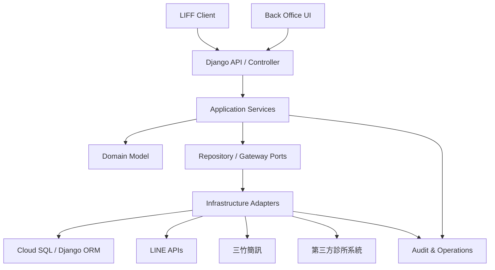
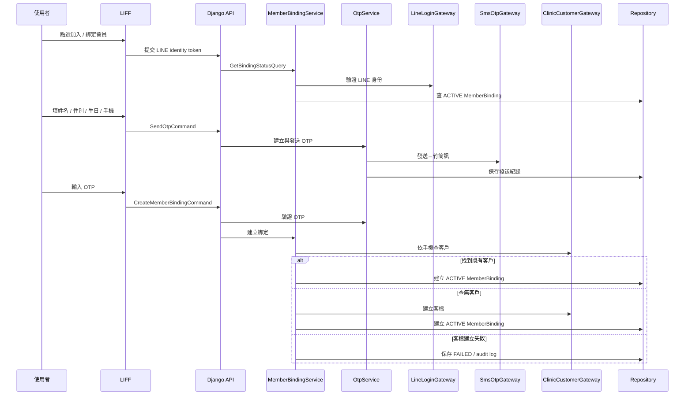
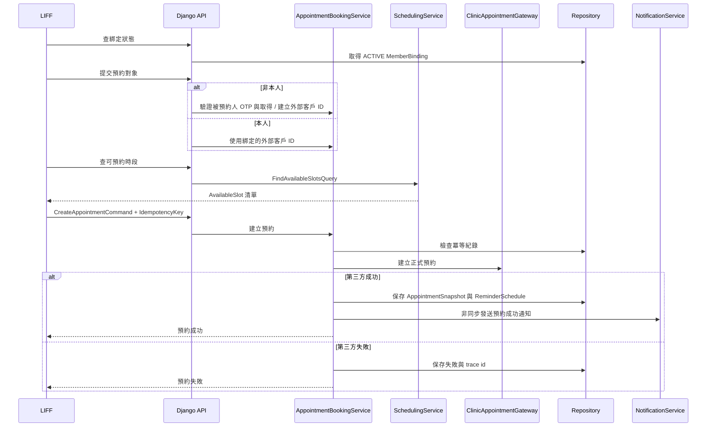

# 診所 LINE 預約系統詳細設計文檔

> 文件狀態：詳細設計草案  
> 來源文件：`proposal.md`、`docs/high-level-design.md`、`AGENT.md`  
> 輸出目的：把概要設計展開為可開發、可測試、可維護的 Django + DDD + OOP 設計  
> 重要原則：未確認的第三方 API、LINE、三竹簡訊、部署與匯入資料細節，不寫成既定事實。

## 1. 設計基準

### 1.1 第一階段目標

第一階段要交付一套可上線使用的最小完整預約流程：

1. 使用者從 LINE 官方帳號 Rich Menu 進入 LIFF 手機版頁面。
2. 後端驗證 LINE Login / LIFF 身份，不信任前端直傳 LINE User ID。
3. 使用者完成會員綁定；若第三方診所系統查無客戶，系統可建立客檔。
4. 使用者可本人預約或非本人預約。
5. 系統依分店、療程、醫師、排班、既有預約、歷史療程與療程規則計算可預約時段。
6. 建立正式預約時，第三方診所系統寫入成功才算預約成功。
7. 預約成功後，本系統保存快照、建立行前提醒排程，並非同步發送 LINE 通知。
8. 使用者可查詢「我的預約」，每次進入或刷新都重新查第三方診所系統。
9. 診所人員可使用最小後台查會員、看排班、維護療程規則、管理後台帳號與查系統紀錄。

### 1.2 技術與開發約束

- 後端採 Django，套件管理使用 `uv`。
- 必須安裝並使用 `mypy`、`ruff`、`pytest` 作為後續程式碼品質與測試工具。
- 採 DDD 領域驅動設計，並以 TDD 確保每個核心對象有完整測試。
- 採 Clean Code：小型類別、明確命名、單一職責、依賴反轉、可讀且可獨立測試。
- Domain object 不依賴 Django model、HTTP client、LINE SDK、三竹 response 或第三方診所系統 response schema。
- 外部 API schema 只能停留在 infrastructure adapter，進入 application/domain 前必須轉為本系統 DTO 或 value object。

### 1.3 第一階段非目標

- 不做原生 iOS / Android App。
- 不提供取消預約與改期操作。
- 不在後台直接編輯第三方診所系統排班。
- 不做完整 CRM、病歷、財務、庫存系統。
- 不匯入病歷、財務、照片。
- 不做多診所集團層級權限。
- 不做多語系。
- 不做大量行銷訊息、促銷推播或 OTP 以外的大量簡訊通知。
- 不提供 LINE 以外登入方式。

## 2. 分層與 Django App 邊界

### 2.1 分層規則

| 層級 | 責任 | 禁止事項 |
| --- | --- | --- |
| LIFF Client | 初始化 LIFF、收集輸入、顯示綁定 / 預約 / 我的預約結果 | 不決定 LINE 身份、不直接呼叫第三方診所系統 |
| Back Office UI | 管理登入、帳號、會員查詢、排班唯讀、療程規則、系統紀錄 | 不放核心預約規則、不直接操作外部 API schema |
| API / Controller | request 格式驗證、session / auth、呼叫 application service、轉 response | 不放業務規則、不直接處理第三方 response |
| Application Service | 編排 use case、交易邊界、冪等、呼叫 domain / repository / gateway | 不實作 HTTP 細節、不變成跨流程大型 service |
| Domain Model | 表達核心規則、狀態轉換、不變量 | 不依賴 Django、SDK、HTTP client、外部 response |
| Ports | 定義 repository / gateway interface | 不包含具體外部連線或 ORM 實作 |
| Infrastructure Adapters | 實作 Django ORM、LINE、三竹、第三方診所系統、worker trigger | 不改寫 domain 規則、不讓外部欄位污染核心模型 |
| Persistence | 保存本系統責任資料、匯入資料、快照、稽核紀錄 | 不取代第三方診所系統成為正式預約主資料來源 |

### 2.2 Django App 建議邊界

以下是設計邊界，不是必須一比一對應最終資料夾。若後續實作要合併 app，仍需保留相同的 domain、application、ports、adapters 邊界。

```text
apps/
  identity_binding/
    domain.py
    application.py
    ports.py
    models.py
    adapters.py
    tests/
  otp_verification/
  customer_import/
  booking/
  scheduling/
  appointment_snapshot/
  notification_reminder/
  backoffice/
  external_integration/
  audit_operations/
```

每個 app 的最小規則：

- `domain.py`：純 Python 物件、value object、enum、domain error。
- `application.py`：use case service、command/query DTO、transaction boundary。
- `ports.py`：repository / gateway protocol 或 abstract interface。
- `models.py`：Django ORM model，負責 persistence mapping。
- `adapters.py`：外部 API、ORM repository、worker trigger 實作。
- `tests/`：domain unit test 優先，再補 application service 與 adapter contract test。

### 2.3 依賴方向



## 3. Bounded Context 與模組設計

| 模組 | 責任 | 非責任 | 主要物件 | Service | Repository / Gateway | 測試重點 |
| --- | --- | --- | --- | --- | --- | --- |
| `identity_binding` | 驗證 LINE 身份，建立 LINE user、手機、本地會員與第三方客戶 ID 對照 | 不發送簡訊、不計算時段、不建立正式預約 | `LineUser`、`MemberBinding`、`CustomerIdentity` | `LineIdentityService`、`MemberBindingService` | `MemberBindingRepository`、`LineLoginGateway`、`ClinicCustomerGateway` | 不信任前端 UID、客檔建立失敗不可啟用綁定 |
| `otp_verification` | 發送與驗證 OTP，控管冷卻、有效期、發送上限與錯誤鎖定 | 不建立會員綁定、不知道預約流程細節 | `OtpVerification`、`OtpAttempt`、`MaskedMobile` | `OtpService` | `OtpRepository`、`SmsOtpGateway` | 60 秒冷卻、5 分鐘有效、錯誤 5 次鎖定、每日上限 |
| `customer_import` | 匯入既有客戶、歷史預約、歷史療程並保存稽核 | 不匯入病歷、財務、照片，不覆蓋未確認資料 | `ImportBatch`、`ImportedCustomer`、`ImportedTreatmentHistory` | `CustomerImportService` | `ImportBatchRepository`、`ImportedHistoryRepository` | 欄位檢查、手機格式、重複資料、缺漏必要欄位 |
| `booking` | 編排本人 / 非本人預約，取得或建立預約對象客檔，送出正式預約 | 不自行判定第三方成功、不發送大量行銷通知 | `BookingSubject`、`BookingCommand`、`BookingResult` | `AppointmentBookingService` | `IdempotencyRepository`、`ClinicCustomerGateway`、`ClinicAppointmentGateway` | 冪等、非本人 OTP、第三方失敗、快照保存失敗補償 |
| `scheduling` | 計算可預約療程與時段，套用耗時、先決療程、安全間隔與術前提醒 | 不建立預約、不直接更改第三方排班 | `TreatmentRule`、`AvailabilityQuery`、`AvailableSlot` | `SchedulingService` | `TreatmentRuleRepository`、`ImportedHistoryRepository`、`ClinicSchedulingGateway` | 不可預約原因、連續空檔、指定醫師與不指定醫師 |
| `appointment_snapshot` | 保存第三方正式預約建立成功後的本地快照與查詢索引 | 不成為正式預約主資料來源、不提供取消改期操作 | `AppointmentSnapshot`、`AppointmentStatusSnapshot` | `MyAppointmentsService` 的查詢協作 | `AppointmentSnapshotRepository`、`ClinicAppointmentGateway` | 外部 ID 必填、狀態唯讀映射、本地保存失敗補償 |
| `notification_reminder` | 建立 LINE 通知紀錄、發送預約成功通知、排程與執行行前提醒 | 不反轉預約成功結果、不做促銷推播 | `NotificationRecord`、`ReminderSchedule`、`ReminderBatch` | `NotificationService`、`ReminderService` | `NotificationRepository`、`ReminderRepository`、`LineMessagingGateway` | 發送失敗不中斷、批次 50 筆、批次間隔 2 秒 |
| `backoffice` | 後台登入、角色授權、會員查詢、排班唯讀、療程規則、系統紀錄 | 不做完整 CRM、不保存病歷財務照片 | `AdminUser`、`AdminRole`、`BackOfficeSession` | `BackOfficeService` | 各 context repository、`ClinicSchedulingGateway` | Admin / Staff 權限、手機遮蔽、停用帳號不可登入 |
| `external_integration` | 隔離第三方診所系統、LINE、三竹 API schema 與錯誤轉換 | 不包含核心 domain 規則 | `ExternalRequestLog`、`GatewayError`、`RequestTraceId` | 各 gateway adapter | 全部 gateway ports | timeout、錯誤碼轉換、trace id、credential 錯誤 |
| `audit_operations` | 保存 OTP、通知、預約寫入失敗、第三方 API 錯誤與維運追蹤 | 不保存完整敏感 payload、不做正式預約主資料 | `AuditLog`、`OperationalIssue`、`ApiErrorSummary` | 被其他 service 呼叫 | `AuditLogRepository`、`ApiRequestLogRepository` | 個資遮蔽、trace 串接、錯誤可查詢 |

## 4. Domain Model 詳細設計

### 4.1 Aggregate / Entity

| 物件 | 類型 | 不變量 | 狀態轉換 / 行為 | 失敗情境 |
| --- | --- | --- | --- | --- |
| `MemberBinding` | Aggregate Root | `line_user_id`、`mobile`、`external_customer_id` 必須存在才可 `ACTIVE` | `activate()`、`deactivate()`、`mark_failed(reason)` | 客檔建立失敗、重複啟用綁定、停用後用於新預約 |
| `OtpVerification` | Aggregate Root | 不保存明文 OTP 到 log；驗證流程需有 purpose、mobile、expires_at | `send()`、`verify(code)`、`expire(now)`、`lock()`、`mark_failed(error)` | 冷卻未到、過期、錯誤 5 次、單手機或單 IP 超過每日上限 |
| `BookingSubject` | Value Object / Entity | `SELF` 使用目前綁定客戶；`OTHER` 需姓名、生日、手機、OTP 驗證結果與外部客戶 ID | `for_self(binding)`、`for_other(profile, otp_result, external_customer_id)` | 非本人未驗證手機、外部客戶 ID 缺漏、資料格式不完整 |
| `TreatmentRule` | Aggregate Root | `duration_minutes` 以 15 分鐘為單位；先決療程與安全間隔可被檢查 | `is_satisfied_by(history)`、`unavailable_reasons(history)` | 先決療程未完成、安全間隔不足、規則資料不完整 |
| `AvailabilityQuery` | Value Object | 分店、療程、日期區間、預約對象必填；指定醫師可選 | `validate()` | 日期區間無效、查詢條件缺漏、醫師 ID 與分店關係待第三方確認 |
| `AvailableSlot` | Value Object | 可預約時需有完整 `time_range`；不可預約時需有結構化原因 | `available(...)`、`unavailable(reason)` | 無連續空檔、無可用醫師、第三方資料不足 |
| `AppointmentSnapshot` | Aggregate Root | 第三方建立成功後才可保存 `external_appointment_id`；本地快照不是正式預約主資料 | `mark_created(external_id)`、`mark_failed(error)`、`mark_external_cancelled()`、`mark_external_rescheduled()` | 第三方建立失敗、本地快照保存失敗、外部狀態值未知 |
| `NotificationRecord` | Aggregate Root | 發送對象、通知類型、狀態必填；失敗需保存摘要 | `mark_sent(line_request_id)`、`mark_failed(error)`、`mark_retrying()`、`give_up()` | LINE 封鎖、權限不足、API 失敗、重試耗盡 |
| `ReminderSchedule` | Aggregate Root | 必須連到預約快照或外部預約 ID；狀態不可跳過規則 | `schedule_for(time)`、`mark_sent()`、`mark_failed(error)`、`skip(reason)` | 第三方狀態不符合、單筆提醒失敗、批次中斷風險 |
| `ImportBatch` | Aggregate Root | 匯入前必須先產生檢查報告；不得直接覆蓋既有資料 | `mark_checked(report)`、`mark_imported(summary)`、`mark_failed(error)` | 欄位缺漏、手機格式錯誤、重複客戶、來源格式未確認 |
| `AdminUser` | Aggregate Root | 角色只允許第一階段定義的 Admin / Staff；停用帳號不可登入 | `can_manage_rules()`、`can_view_members()`、`deactivate()`、`reset_password()` | Staff 操作帳號管理、停用帳號登入、權限繞過 |

### 4.2 Value Object

| Value Object | 用途 | 規則 |
| --- | --- | --- |
| `LineUserId` | LINE 使用者唯一識別 | 只能由後端驗證 LINE token 後建立 |
| `Mobile` | 手機號碼 | 台灣手機格式：`09` 開頭，共 10 碼 |
| `MaskedMobile` | UI / log 顯示 | 不顯示完整手機 |
| `ExternalCustomerId` | 第三方客戶 ID | 不假設格式，只保存外部識別 |
| `ExternalAppointmentId` | 第三方預約 ID | 第三方建立正式預約成功後才保存 |
| `DateTimeRange` | 排班、預約、查詢區間 | `start_at` 必須早於 `end_at`，時區策略待部署設計定稿 |
| `DurationMinutes` | 療程耗時 | 以 15 分鐘為單位 |
| `SafetyInterval` | 安全間隔 | 可用天數或分鐘表示，實際單位由後台規則定義 |
| `IdempotencyKey` | 寫入操作冪等鍵 | 同一建立預約操作唯一 |
| `RequestTraceId` | 跨系統追蹤 | 串接 API request、錯誤、通知、維運紀錄 |

### 4.3 Enum / Status

| Enum | 狀態 |
| --- | --- |
| `BindingStatus` | `ACTIVE`、`INACTIVE`、`FAILED` |
| `OtpPurpose` | `MEMBER_BINDING`、`PROXY_BOOKING` |
| `OtpStatus` | `CREATED`、`SENT`、`VERIFIED`、`EXPIRED`、`LOCKED`、`FAILED` |
| `BookingSubjectType` | `SELF`、`OTHER` |
| `AppointmentSnapshotStatus` | `CREATED`、`FAILED`、`EXTERNAL_CANCELLED`、`EXTERNAL_RESCHEDULED` |
| `NotificationType` | `APPOINTMENT_SUCCESS`、`PRE_VISIT_REMINDER` |
| `NotificationStatus` | `PENDING`、`SENT`、`FAILED`、`RETRYING`、`GAVE_UP` |
| `ReminderStatus` | `SCHEDULED`、`SENT`、`FAILED`、`SKIPPED` |
| `ImportBatchStatus` | `UPLOADED`、`CHECKED`、`IMPORTED`、`FAILED` |
| `AdminRole` | `ADMIN`、`STAFF` |

## 5. Application Services 與 Use Case 介面

對外 HTTP URL 不在本文件定案。Controller 只負責把 request 轉成 command/query DTO，呼叫 application service，再把 result 轉成 response。

| Service | Command / Query | 輸入 | 輸出 | 交易與錯誤邊界 |
| --- | --- | --- | --- | --- |
| `LineIdentityService` | `VerifyLineIdentityQuery` | LIFF / LINE Login token | 可信 LINE 使用者摘要 | LINE 驗證失敗時回傳身份錯誤，不建立本地身份 |
| `MemberBindingService` | `GetBindingStatusQuery` | LINE identity token | 是否已綁定、綁定摘要 | 需先呼叫 `LineIdentityService` |
| `MemberBindingService` | `CreateMemberBindingCommand` | LINE identity、姓名、性別、生日、手機、OTP 驗證結果 | 綁定成功或失敗 | 客檔建立失敗不可建立 `ACTIVE` 綁定 |
| `OtpService` | `SendOtpCommand` | 手機、用途、LINE 身份、來源 IP | 發送結果、冷卻資訊 | 需檢查冷卻、每日上限與 provider 錯誤 |
| `OtpService` | `VerifyOtpCommand` | 驗證流程 ID、驗證碼 | 驗證結果 | 過期、錯誤 5 次、已鎖定需回明確失敗 |
| `CustomerImportService` | `CheckImportBatchCommand` | 來源檔案或來源資料參照 | 欄位對應與錯誤報告 | 不寫入正式匯入資料 |
| `CustomerImportService` | `ExecuteImportBatchCommand` | 已檢查批次 ID | 匯入結果 | 只處理已檢查批次，不直接覆蓋既有資料 |
| `SchedulingService` | `FindAvailableSlotsQuery` | 分店、療程、醫師、日期區間、預約對象 | `AvailableSlot` 清單與不可預約原因 | 第三方資料不足需回結構化不可預約原因 |
| `AppointmentBookingService` | `CreateAppointmentCommand` | LINE 身份、預約對象、分店、療程、醫師、時段、冪等鍵 | 預約成功或失敗結果 | 第三方正式預約成功才算成功；通知失敗不反轉成功 |
| `MyAppointmentsService` | `ListMyAppointmentsQuery` | LINE identity token | 第三方預約列表 DTO | 每次查詢都呼叫第三方，不長期保存查詢結果 |
| `NotificationService` | `SendNotificationCommand` | 預約快照 ID、通知類型 | 通知紀錄 | 發送失敗只更新通知狀態 |
| `ReminderService` | `RunReminderBatchCommand` | 排程觸發時間 | 批次發送結果 | 每批 50 筆、間隔 2 秒、單筆失敗不中斷 |
| `BackOfficeService` | `BackOfficeQueryOrCommand` | 後台 session、查詢或管理資料 | 管理結果 | 每個操作都檢查 Admin / Staff 權限 |

## 6. Repository 與 Gateway Ports

### 6.1 Repository Ports

| Repository | 責任 | 對應資料模型 |
| --- | --- | --- |
| `MemberBindingRepository` | 查詢啟用綁定、依 LINE user / 手機查綁定、保存綁定狀態 | `member_bindings` |
| `OtpRepository` | 建立 OTP 流程、保存發送與驗證狀態、查詢冷卻與上限 | `otp_verifications` |
| `ImportBatchRepository` | 保存匯入批次、檢查報告、匯入結果 | `import_batches`、`imported_customers` |
| `ImportedHistoryRepository` | 查客戶歷史預約與療程，用於療程規則判斷 | `imported_appointments`、`imported_treatment_histories` |
| `TreatmentRuleRepository` | 讀寫療程耗時、先決療程、安全間隔、術前提醒 | `treatment_rules` |
| `IdempotencyRepository` | 保存建立預約 request 的冪等鍵與結果摘要 | 可獨立表或併入預約寫入紀錄，實作時定稿 |
| `AppointmentSnapshotRepository` | 保存與查詢本地預約快照 | `appointment_snapshots` |
| `ReminderRepository` | 建立與更新行前提醒排程 | `reminder_schedules` |
| `NotificationRepository` | 建立與更新 LINE 通知紀錄 | `notification_records` |
| `AdminUserRepository` | 後台帳號、角色、狀態、登入資訊 | `admin_users` |
| `ApiRequestLogRepository` | 保存第三方 / LINE / 三竹 API request 摘要 | `api_request_logs` |
| `AuditLogRepository` | 保存操作、錯誤與維運追蹤紀錄 | `audit_logs` |

### 6.2 Gateway Ports

| Gateway | 必要能力 | 待確認事項 |
| --- | --- | --- |
| `LineLoginGateway` | 驗證 LIFF / LINE Login token，取得可信 LINE User ID | Provider、LINE Login Channel、測試帳號與權限 |
| `LineMessagingGateway` | 發送預約成功通知與行前提醒，回傳 LINE request id 與錯誤摘要 | 使用純文字或 Flex Message、封鎖事件是否需業務處理 |
| `SmsOtpGateway` | 發送三竹 OTP，處理 URL Encode、`CharsetURL`、供應商回應摘要 | 正式 endpoint、測試方式、Big5 或 UTF-8、OTP 文案是否送審 |
| `ClinicAuthGateway` | 取得與刷新第三方診所系統 API token | 正式產品名稱、base URL、sandbox、token 規格 |
| `ClinicCustomerGateway` | 依手機查客戶、建立客戶、讀取客戶基本資料 | 客戶欄位、建立客戶是否支援冪等鍵、錯誤碼 |
| `ClinicDirectoryGateway` | 讀取分店、醫師、科別或主檔 | 主檔欄位語意與更新頻率 |
| `ClinicTreatmentGateway` | 讀取分店可預約療程或服務項目 | 療程 ID、療程名稱、可預約條件欄位 |
| `ClinicSchedulingGateway` | 讀取醫師排班、休診、指定區間既有預約 | 排班與休診欄位、時區、同時搶位錯誤碼 |
| `ClinicAppointmentGateway` | 建立正式預約、查預約列表、查單筆預約 | 建立預約是否支援冪等鍵、狀態值、取消 / 改期語意 |
| `ClinicEventGateway` | 若第三方支援 webhook 或 event history，封裝事件查詢與補償 | 是否提供 webhook 或 event history |

### 6.3 Adapter 錯誤轉換

Gateway adapter 需把外部錯誤轉成系統可理解的 `GatewayError`：

| 錯誤類型 | 使用場景 | Application 行為 |
| --- | --- | --- |
| `AUTH_FAILED` | token 無效、channel 權限不足、簡訊帳密錯誤 | 回可理解錯誤，保存 `api_request_logs` |
| `RATE_LIMITED` | LINE、三竹或第三方 API rate limit | 保存錯誤摘要；可重試與否由 use case 決定 |
| `VALIDATION_FAILED` | 外部認為資料格式或必要欄位錯誤 | 不建立成功狀態，回使用者可理解原因 |
| `CONFLICT` | 同一時段被其他人建立預約 | 預約失敗，提示重新選擇時段 |
| `TEMPORARY_UNAVAILABLE` | timeout、服務暫時不可用 | 保存 trace id；可進入重試或維運處理 |
| `UNKNOWN_EXTERNAL_ERROR` | 未知錯誤碼或 response 格式 | 保存摘要與原始 trace，避免寫成成功 |

## 7. 概念資料模型

本節是本地資料庫概念設計，不是正式 Django migration。欄位名稱、index、nullable 與 constraint 需在實作階段依 model 與查詢需求定稿。

| 表 / 儲存模型 | 用途 | 關鍵欄位 |
| --- | --- | --- |
| `member_bindings` | LINE user、手機、本地會員與第三方客戶 ID 對照 | `id`、`line_user_id`、`mobile_masked`、`mobile_hash`、`external_customer_id`、`status` |
| `otp_verifications` | OTP 發送、驗證、冷卻、鎖定與稽核 | `id`、`purpose`、`mobile_hash`、`status`、`sent_at`、`expires_at`、`attempt_count`、`provider_summary` |
| `import_batches` | 既有資料匯入批次 | `id`、`source_file_name`、`status`、`checked_count`、`success_count`、`failed_count`、`error_summary` |
| `imported_customers` | 匯入客戶基本資料 | `id`、`import_batch_id`、`name`、`gender`、`birthday`、`mobile_hash`、`external_customer_id`、`source_ref` |
| `imported_appointments` | 匯入歷史預約 | `id`、`external_customer_id`、`branch_id`、`treatment_id`、`doctor_id`、`start_at`、`status`、`external_appointment_id` |
| `imported_treatment_histories` | 匯入歷史療程 | `id`、`external_customer_id`、`treatment_code`、`performed_at`、`status` |
| `treatment_rules` | 後台療程規則 | `id`、`branch_id`、`treatment_id`、`duration_minutes`、`prerequisites`、`safety_interval`、`pre_care_note` |
| `appointment_snapshots` | 第三方正式預約成功後的本地快照 | `id`、`external_appointment_id`、`created_by_line_user_id`、`subject_type`、`branch_id`、`treatment_id`、`doctor_id`、`start_at`、`status` |
| `reminder_schedules` | 行前提醒排程 | `id`、`appointment_snapshot_id`、`external_appointment_id`、`scheduled_for`、`status`、`last_error` |
| `notification_records` | LINE 通知請求與發送結果 | `id`、`line_user_id`、`type`、`status`、`line_request_id`、`error_code`、`retry_count` |
| `admin_users` | 後台帳號 | `id`、`username`、`role`、`status`、`last_login_at` |
| `api_request_logs` | 第三方、LINE、三竹 API 追蹤 | `trace_id`、`target_system`、`operation`、`status_code`、`duration_ms`、`error_summary` |
| `audit_logs` | 系統操作與錯誤稽核 | `id`、`actor_type`、`actor_id`、`action`、`target_type`、`target_id`、`created_at` |

資料責任：

- 第三方診所系統是正式客戶與正式預約主資料來源。
- 本系統保存 LINE User ID、會員綁定、OTP 紀錄、匯入資料、療程規則、預約快照、提醒排程、通知紀錄、管理員帳號與稽核紀錄。
- 「我的預約」查詢結果不長期保存，只做單次頁面暫存。
- 手機號碼可因 OTP、綁定、客服查詢而保存，但 log 與列表必須遮蔽。
- 不在 log 輸出完整 OTP 驗證碼、完整手機號碼或高敏感 payload。

## 8. 主要流程詳細設計

### 8.1 會員綁定與客檔建立



約束：

- OTP 驗證成功前不得建立可用綁定。
- 客檔建立失敗不得建立 `ACTIVE` 綁定。
- 同一 LINE user 已有 `ACTIVE` 綁定時，預設回綁定狀態，不重複建立；是否允許換綁需另行確認。

### 8.2 本人與非本人預約



約束：

- 預約成功只以第三方診所系統建立正式預約成功為準。
- 本地 `AppointmentSnapshot` 是快照與追蹤資料，不是正式預約主資料。
- 非本人預約必須保存由哪個 LINE 帳號代為建立。
- LINE 通知非同步發送，失敗不反轉預約成功。

### 8.3 可預約時段計算

輸入：

- 第三方客戶 ID。
- 分店 ID。
- 療程 ID。
- 療程耗時。
- 是否指定醫師。
- 指定醫師 ID。
- 查詢時間區間，預設往後 7 天。
- 第三方醫師排班、休診、已預約資料。
- 本系統療程先決條件、安全間隔、術前提醒。
- 客戶歷史預約與療程紀錄。

輸出：

- 可預約的 `AvailableSlot`。
- 不可預約原因：先決療程未完成、安全間隔不足、無可用醫師、無連續空檔、第三方資料不足。

設計規則：

- `SchedulingService` 只負責查詢與計算，不建立正式預約。
- `TreatmentRule` 負責療程規則判斷，避免規則散落在 service 流程中。
- 外部排班與既有預約需先轉為本系統可理解的時間區間 DTO，再交給 domain 計算。
- 若第三方資料不足，不應猜測可約；應回不可預約原因並保存必要 trace。

### 8.4 我的預約

- 使用者進入頁面時提交 LINE identity token。
- 後端驗證 LINE 身份並取得 `ACTIVE` 綁定。
- `MyAppointmentsService` 以綁定的第三方客戶 ID 查第三方預約列表。
- 回傳分店、療程、醫師、日期時間與預約狀態。
- 查詢結果只做頁面暫存；重新進入或手動刷新時重新查第三方。
- 第一階段不提供取消與改期；若第三方回已取消或已改期狀態，只能唯讀呈現。

### 8.5 行前提醒

- 排程由 VM Cron、Cloud Scheduler 或等效方式觸發，實際部署方式待維運設計確認。
- `ReminderService` 查詢隔日提醒候選資料。
- 必要時向第三方診所系統校驗預約狀態。
- 每批預設 50 筆，批次間隔 2 秒。
- 單筆 LINE 發送失敗只記錄失敗原因，不中斷整批任務。
- LINE user 封鎖官方帳號或 LINE API 失敗需更新 `NotificationRecord` 與 `ReminderSchedule`。

### 8.6 最小後台

| 功能 | Admin | Staff | 設計重點 |
| --- | --- | --- | --- |
| 登入 / 登出 / Session 逾時 | 可 | 可 | 停用帳號不可登入 |
| 帳號管理 | 可 | 不可 | 新增、停用、重設 Staff 密碼 |
| 會員查詢 | 可 | 可 | 依姓名、手機、LINE 綁定狀態；手機需遮蔽 |
| 會員詳情 | 可 | 可 | 顯示本地會員、匯入摘要、第三方客戶 ID、預約查詢入口 |
| 排班唯讀 | 可 | 可 | 從第三方查詢，不提供編輯 |
| 療程規則管理 | 可 | 不可 | 耗時、先決療程、安全間隔、術前提醒 |
| 系統紀錄 | 可 | 可 | OTP、通知、預約寫入失敗、第三方 API 錯誤摘要 |

## 9. 錯誤處理、冪等與補償

| 場景 | 設計策略 |
| --- | --- |
| 使用者重複送出預約 | 前端鎖定按鈕，後端用 `IdempotencyKey` 保護建立預約操作 |
| 第三方查無客戶 | 依需求嘗試在第三方診所系統建立客檔 |
| 第三方客檔建立失敗 | 不建立可用綁定或預約，保存錯誤摘要與 trace id |
| 第三方建立預約失敗 | 顯示失敗結果，保存預約寫入失敗紀錄 |
| 第三方建立預約成功但本地快照保存失敗 | 以 trace id 與第三方預約 ID 建立維運補償紀錄 |
| 本地快照保存成功但 LINE 通知失敗 | 預約結果維持成功，通知進入 `FAILED` 或 `RETRYING` |
| 行前提醒單筆失敗 | 記錄失敗原因，繼續處理同批或下一批 |
| Webhook 重複送達 | 若未來啟用 webhook，以外部事件 ID 或 payload 指紋做冪等 |
| 第三方 API token 過期 | `ClinicAuthGateway` 統一 refresh，避免各 adapter 自行處理 |
| 簡訊餘額不足或供應商失敗 | 保存供應商回應摘要，回傳可理解錯誤並通知維運；通知對象待確認 |

冪等設計原則：

- 寫入型 use case 至少包含建立預約。
- 同一 `IdempotencyKey` 重複送出時，若前次已成功，回相同成功摘要。
- 若前次正在處理中，回處理中或要求稍後重試，實際策略在 API 設計階段定稿。
- 即使第三方不支援冪等鍵，本地仍要避免同一 request 重複送出。

補償設計原則：

- 只補償本系統可追蹤的狀態，不自行修改第三方正式資料。
- 第三方成功、本地失敗是最高風險情境，必須保存外部預約 ID、trace id、錯誤摘要。
- 補償紀錄應可在後台系統紀錄查詢。

## 10. 安全、隱私與非功能設計

| 面向 | 設計要求 |
| --- | --- |
| 傳輸安全 | 對外服務使用 HTTPS / SSL |
| 身份驗證 | LINE 身份由後端驗證；後台需登入與 session 控制 |
| 憑證管理 | LINE、第三方診所系統、三竹簡訊憑證以環境變數或 Secret 管理 |
| 個資最小化 | 不保存病歷、財務、照片；log 避免完整手機與敏感 payload |
| 手機資料 | 保存 `mobile_hash` 與遮蔽顯示；完整手機只限必要流程使用 |
| OTP | 不在 log 保存明文驗證碼；錯誤次數、過期與鎖定需可稽核 |
| 權限 | 後台角色至少 Admin、Staff |
| 稽核 | OTP、LINE 通知、預約寫入失敗、第三方 API 錯誤需可查 |
| 效能 | 可預約時段查詢是高風險流程，需在 PoC 與測試階段量測 |
| 可用性 | LINE 或簡訊發送失敗不得造成正式預約資料不一致 |
| 備份 | Cloud SQL 需設定備份策略，保留天數待確認 |
| 固定出口 IP | 若第三方要求 IP 白名單，需納入部署驗收 |

## 11. 測試策略與 TDD 驗收

### 11.1 測試類型

| 測試類型 | 覆蓋對象 | 重點 |
| --- | --- | --- |
| Domain unit test | `MemberBinding`、`OtpVerification`、`TreatmentRule`、`AvailableSlot`、`AppointmentSnapshot`、`NotificationRecord`、`ImportBatch`、`AdminUser` | 狀態轉換、資料不變量、錯誤分支 |
| Application service test | 各 use case service | 編排流程、交易邊界、冪等、第三方失敗處理 |
| Contract test | 第三方診所系統、LINE、三竹 gateway | schema 假設、錯誤碼轉換、timeout、retry |
| Integration test | LINE 驗證、OTP 發送、查客戶、建客檔、查排班、建預約、查我的預約 | 使用 sandbox 或測試帳號驗證最大風險 |
| Import test | `CustomerImportService` | 欄位對應、手機格式錯誤、重複客戶、缺漏必要欄位 |
| Reminder test | `ReminderService` | 隔日預約查詢、批次 50 筆、單筆失敗不中斷 |
| Back office permission test | 後台帳號、角色、會員查詢、療程規則 | Admin / Staff 權限與資料遮蔽 |
| LIFF-to-booking smoke test | LIFF 入口到預約成功通知 | 核心流程完整走通 |

### 11.2 Domain 測試清單

- `MemberBinding`：缺少 `external_customer_id` 不可 `ACTIVE`；停用後不可用於新預約。
- `OtpVerification`：冷卻未到不可重發；5 分鐘後過期；錯誤 5 次鎖定；不輸出明文 OTP。
- `BookingSubject`：本人預約只能使用目前綁定客戶；非本人預約需 OTP 驗證與外部客戶 ID。
- `TreatmentRule`：耗時需為 15 分鐘單位；先決療程未滿足回不可預約原因；安全間隔不足回不可預約原因。
- `AvailableSlot`：無連續空檔、無可用醫師、第三方資料不足時回結構化原因。
- `AppointmentSnapshot`：沒有第三方預約 ID 不可標記建立成功；外部取消或改期只做唯讀狀態。
- `NotificationRecord`：發送成功保存 LINE request id；失敗保存錯誤摘要並可進入重試。
- `ReminderSchedule`：單筆失敗不影響其他提醒；第三方狀態不符合時可 `SKIPPED`。
- `ImportBatch`：未檢查不可執行匯入；錯誤清單需保留。
- `AdminUser`：Staff 不可管理帳號或療程規則；停用帳號不可登入。

### 11.3 Application Service 測試清單

- 會員綁定：LINE 驗證成功、OTP 成功、第三方找到客戶時建立 `ACTIVE` 綁定。
- 會員綁定：第三方查無客戶且建檔成功時建立 `ACTIVE` 綁定。
- 會員綁定：第三方建檔失敗時回失敗，不建立 `ACTIVE` 綁定。
- OTP：重發冷卻、每日手機上限、每日 IP 上限、provider 失敗。
- 本人預約：使用綁定外部客戶 ID 建立正式預約，成功後保存快照與提醒。
- 非本人預約：被預約人 OTP 成功後取得或建立外部客戶 ID，保存代訂 LINE 帳號。
- 預約冪等：相同冪等鍵重複送出不重複建立第三方預約。
- 建立預約：第三方時段衝突時回失敗並保存 trace id。
- 我的預約：每次查詢都呼叫第三方，不依賴本地快照當作完整列表。
- 行前提醒：批次中單筆 LINE 失敗不終止整批。
- 後台：Admin / Staff 權限差異與手機遮蔽。

### 11.4 驗證工具

後續程式碼實作時的最低驗證命令：

```powershell
uv run ruff check .
uv run mypy .
uv run pytest
```

本文件建立時只做 Markdown 與 UTF-8 讀回檢查，不執行上述命令，因目前任務只新增設計文件。

## 12. 待確認事項

### 12.1 第三方診所系統

1. 正式產品名稱、廠商名稱與 API 文件版本。
2. 正式與測試環境 base URL。
3. 是否有 sandbox、測試帳號與可寫入測試資料。
4. 是否需要固定出口 IP 或 IP 白名單。
5. API rate limit、錯誤碼列表與固定 response 格式。
6. 建立客戶與建立預約是否支援冪等鍵。
7. 同時多人預約同一時段時的錯誤碼與建議處理。
8. 預約列表狀態值、取消狀態、改期狀態與時間欄位語意。
9. 客戶歷史療程欄位是否足以判斷先決療程與安全間隔。
10. 是否提供 webhook 或 event history 用於預約狀態補償。

### 12.2 LINE

1. LINE Official Account 是否已存在，權限由誰管理。
2. Provider、Messaging API Channel、LINE Login Channel 是否由本案建立。
3. Rich Menu 視覺與文案是否由診所提供或由本案建立。
4. 通知訊息使用純文字或 Flex Message。
5. 封鎖、解除封鎖、加好友事件是否需要進一步業務處理。

### 12.3 三竹簡訊

1. 三竹帳號由誰申請，企業證明由誰提供。
2. 費用由誰儲值與結算。
3. 正式 API endpoint、測試方式、編碼設定。
4. OTP 簡訊文案是否需送審。
5. 上線後簡訊餘額不足時通知誰。

### 12.4 資料匯入

1. 來源資料格式：Excel、CSV、資料庫匯出或第三方 API。
2. 欄位清單與必要欄位。
3. 手機重複、姓名重複、生日缺漏時的處理規則。
4. 第三方客戶 ID 是否已存在於來源資料。
5. 匯入驗收由誰確認。

### 12.5 部署與維運

1. 正式域名由誰提供，DNS 由誰管理。
2. GCP project、VM、Cloud SQL 權限由誰建立。
3. SSL 憑證與更新責任。
4. Cloud SQL 備份保留天數。
5. 上線後維護、保固與需求變更是否另計。
6. 錯誤通知要通知誰，以及使用 Email、LINE 群或其他方式。

## 13. PoC 與開發順序建議

正式開發前，優先用 PoC 驗證最大風險：

1. LINE LIFF 初始化與 LINE Login 後端驗證。
2. 三竹 OTP 測試發送。
3. 第三方診所系統 token 取得與刷新。
4. 依手機查客戶。
5. 建立測試客檔。
6. 查分店、療程、醫師排班。
7. 查客戶歷史預約與療程紀錄。
8. 建立測試預約。
9. 查我的預約列表。
10. 發送 LINE 預約成功通知。
11. 觸發一批行前提醒測試。

建議開發順序：

1. 建立 Django 專案骨架、app 邊界、測試工具與 CI 檢查命令。
2. 先寫 domain object 與 unit test：OTP、會員綁定、療程規則、時段、預約快照。
3. 定義 repository / gateway ports，使用 fake adapter 完成 application service test。
4. 實作 LINE Login 與三竹 OTP gateway 的 contract test。
5. 實作第三方診所系統授權、查客戶、建客檔、查排班、建預約 gateway。
6. 完成本人預約與非本人預約主流程。
7. 補我的預約、通知、行前提醒與後台最小功能。
8. 完成匯入檢查與匯入後療程規則判斷。
9. 執行 LIFF-to-booking smoke test 與 PoC 驗收。

## 14. 結論

本詳細設計把第一階段系統拆成可獨立測試的 domain、application service、repository port 與 gateway adapter。核心原則是：

- 第三方診所系統是正式預約與客戶主資料來源。
- 本系統保存綁定、OTP、匯入資料、療程規則、預約快照、通知、提醒與稽核紀錄。
- Domain 保持純粹，外部 API schema 只能存在於 adapter。
- Application service 負責用例編排、交易邊界、冪等與錯誤處理。
- 每個核心物件都要先有 TDD 測試覆蓋成功路徑、非法狀態、外部失敗與補償分支。
