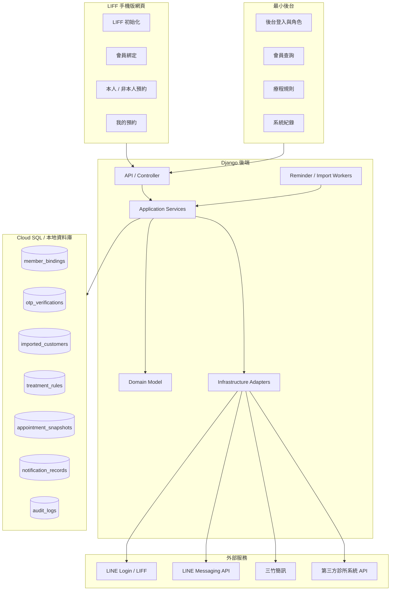
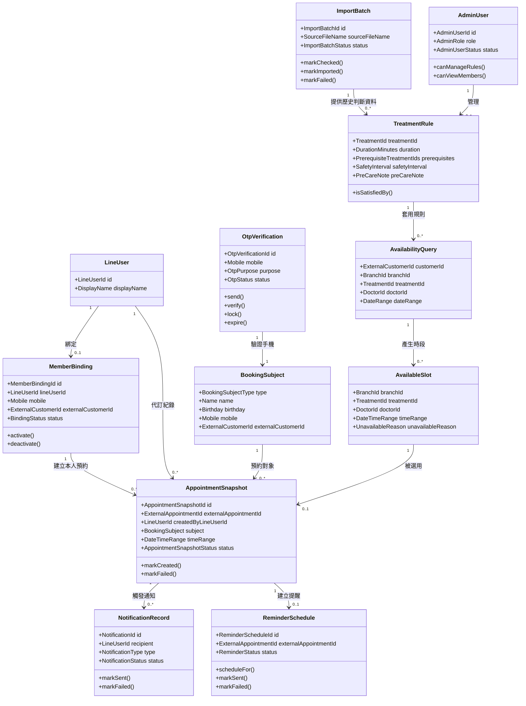
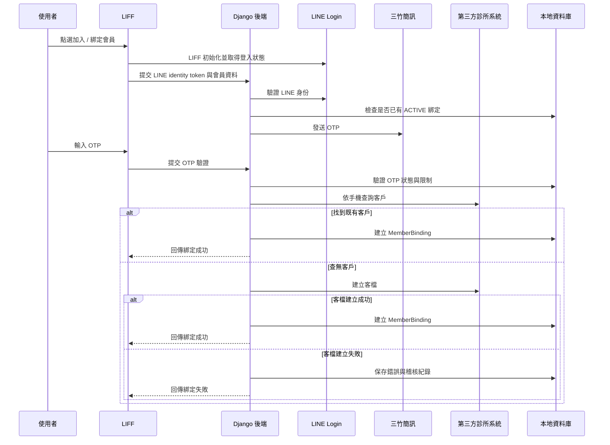
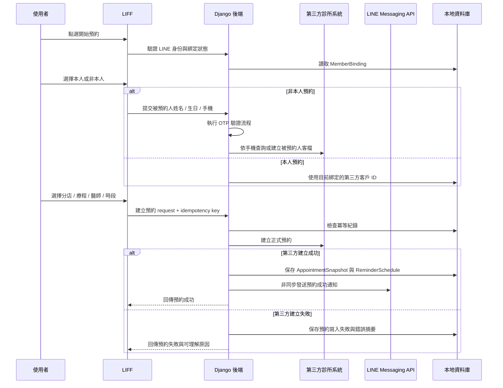
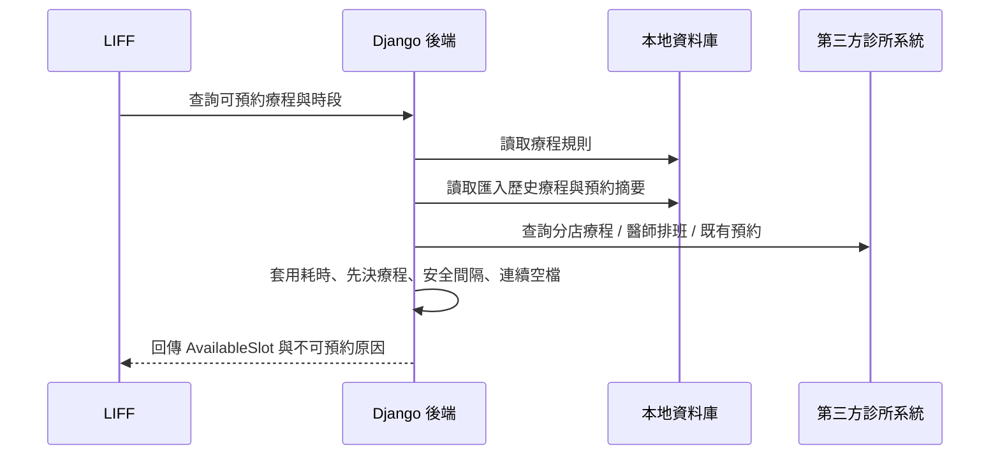
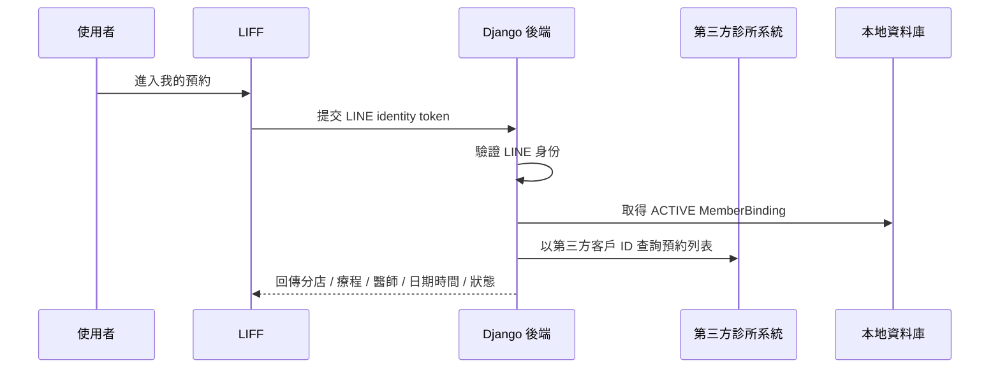
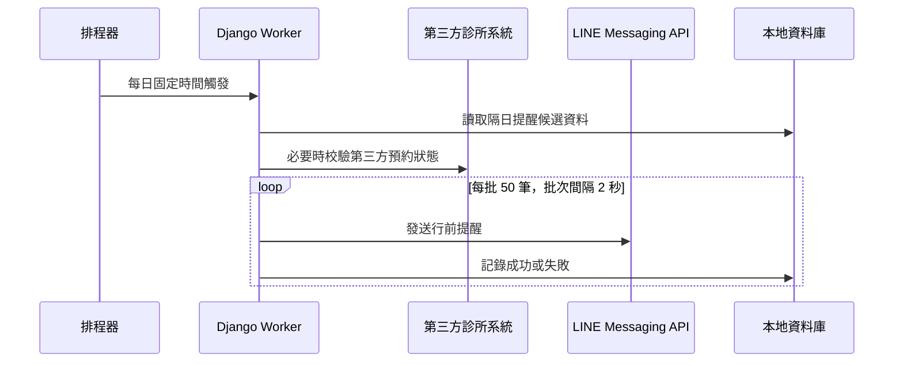

# 診所 LINE 預約系統概要設計文檔

> 依據文件：`proposal.md`、`AGENT.md`、`proposal-deep-research-report.md`  
> 初版產出日期：2026-05-19  
> 最近更新日期：2026-05-23  
> 文件狀態：概要設計草案，依 `proposal.md` v0.2 重寫  
> 設計原則：`proposal.md` 是第一階段功能範圍的唯一主要來源；若與舊版概要設計衝突，以新版需求為準。未確認事項只標示為待確認，不寫成既定需求。

## 1. 文件目的

本文將 `proposal.md` 中的第一階段需求轉換為高階技術設計，重點是模組劃分、DDD bounded context、核心類別與物件關係、資料責任、外部整合邊界與測試策略。本文不是 UI 設計、資料庫 migration、報價文件或最終 API 規格。

本次版本刻意移除舊設計中已不符合新版需求的主流程假設。第一階段的預約成功定義是第三方診所系統建立正式預約成功；會員綁定與非本人預約若查無客戶，系統可在第三方診所系統建立客檔，客檔建立失敗才進入錯誤紀錄與維運處理。

## 2. 需求摘要與設計基準

| 類別 | 第一階段需求 | 設計影響 |
| --- | --- | --- |
| 產品定位 | 診所 LINE 預約系統 | 以預約、會員綁定、提醒、後台查詢為核心，不擴張成完整 CRM |
| 入口 | LINE Official Account、Rich Menu、LIFF 手機版網頁 | 前端以 mobile-first LIFF 流程設計；後端仍要驗證 LINE 身份 |
| 身份 | LINE Login / LIFF 取得可驗證身份 | 不信任前端直傳 LINE User ID |
| 會員綁定 | LINE user、手機、本地會員與第三方客戶 ID 對照 | 綁定是預約與我的預約的前置資料 |
| 客檔建立 | 查無第三方客戶時可建立客檔 | 需要 customer gateway 與建立失敗紀錄 |
| 預約對象 | 支援本人與非本人預約 | 預約命令需明確記錄預約對象與代訂 LINE 帳號 |
| 時段計算 | 依分店、療程、醫師、排班、既有預約與療程規則計算 | 需要獨立 Scheduling & Treatment Rules context |
| 預約成功 | 第三方診所系統建立預約成功即為第一階段預約成功 | 本地預約快照不能取代第三方正式預約 |
| 我的預約 | 每次進入或刷新都重新查第三方診所系統 | 查詢結果只做頁面暫存，不長期保存 |
| 通知與提醒 | 預約成功 LINE 通知、行前提醒排程 | 通知失敗不影響預約結果，但需可追蹤 |
| 後台 | 最小後台：帳號、會員查詢、排班唯讀、療程規則、系統紀錄 | 後台是第一階段範圍，不是延伸功能 |
| 既有資料 | 匯入約 5,000 筆客戶基本資料、歷史預約與療程紀錄 | 需要 import batch、匯入檢查與稽核模型 |
| 技術限制 | 後端 Django、uv、mypy、ruff、pytest；DDD、Clean Code、TDD | Domain 與 use case 必須可測、依賴方向清楚 |

## 3. 範圍邊界

### 3.1 第一階段包含

- LINE Official Account、LINE Login、LIFF、Rich Menu 與 Webhook 入口相關設計。
- 會員綁定、三竹簡訊 OTP、本人預約、非本人預約、我的預約。
- 可預約時段計算與後台療程規則。
- 第三方診所系統客戶、分店、醫師、療程、排班、預約 API 的 adapter 邊界。
- 預約成功通知、行前提醒排程、通知紀錄與錯誤紀錄。
- 既有客戶基本資料、歷史預約、歷史療程的匯入與稽核。
- 最小後台的帳號、角色、會員查詢、排班唯讀、療程規則與系統紀錄。
- GCP VM、Docker、Cloud SQL、HTTPS、Secret、備份與基本 log 的部署邊界。

### 3.2 第一階段不包含

- 原生 iOS / Android App。
- 取消預約操作與改期操作。
- 後台直接編輯第三方診所系統排班。
- 完整 CRM、病歷、財務、庫存系統。
- 病歷、財務、照片資料匯入。
- 多診所集團層級權限。
- 多語系。
- 大量行銷訊息或促銷推播。
- LINE 以外的登入方式。
- 除 OTP 外的大量簡訊通知。

## 4. 系統總覽

### 4.1 外部參與者與系統

| 參與者 / 系統 | 角色 |
| --- | --- |
| 使用者 | 從 LINE Rich Menu 進入 LIFF，完成綁定、本人或非本人預約、我的預約查詢 |
| 診所人員 | 透過最小後台查詢會員、排班、系統紀錄，維護療程規則與後台帳號 |
| LINE / LIFF | 手機版預約入口與 LINE 使用者情境來源 |
| LINE Login | 提供可由後端驗證的使用者身份 |
| LINE Messaging API | 發送預約成功通知與行前提醒 |
| 三竹簡訊 | 發送會員綁定與非本人預約所需 OTP |
| 第三方診所系統 | 正式客戶、排班、預約與預約查詢資料來源 |
| 診所 LINE 預約系統後端 | 編排用例、保護 domain 規則、隔離外部 API、保存本地責任資料 |
| Cloud SQL | 保存本地會員綁定、OTP、匯入資料、療程規則、預約快照、通知與稽核紀錄 |

### 4.2 架構概念圖

## 5. 分層設計

| 層級 | 責任 | 不應負責 |
| --- | --- | --- |
| LIFF Client | 初始化 LIFF、呈現綁定 / 預約 / 我的預約流程、收集輸入、顯示結果 | 不直接信任或決定 LINE 身份；不直接呼叫第三方診所系統 |
| Back Office UI | 管理登入、帳號、會員查詢、排班唯讀、療程規則、系統紀錄 | 不直接存取外部 API；不放核心預約規則 |
| API / Controller | 驗證 request 格式、處理 session / auth、呼叫 application service、轉換 response | 不放業務規則；不直接操作外部 schema |
| Application Services | 編排用例、交易邊界、冪等、呼叫 domain、repository、gateway | 不實作 HTTP 細節；不把流程寫成大型程序物件 |
| Domain Model | 表達會員綁定、OTP、預約對象、療程規則、時段、預約快照、通知狀態 | 不依賴 Django model、HTTP client、LINE SDK 或第三方 response |
| Infrastructure Adapters | 實作 LINE、三竹簡訊、第三方診所系統、repository、worker trigger | 不改寫 domain 規則；不讓外部欄位污染核心模型 |
| Persistence | 保存本系統責任資料、匯入資料、快照、紀錄、稽核 | 不取代第三方診所系統作為正式預約主資料來源 |

## 6. Bounded Context 劃分

| Context | 核心責任 | 主要物件 | 主要外部依賴 |
| --- | --- | --- | --- |
| Identity & Binding | 驗證 LINE 身份，建立 LINE user、手機、本地會員與第三方客戶 ID 對照 | `LineUser`、`MemberBinding`、`CustomerIdentity` | LINE Login、第三方客戶 API |
| OTP Verification | 發送與驗證三竹簡訊 OTP，控管冷卻、有效期、錯誤鎖定與發送上限 | `OtpVerification`、`OtpAttempt`、`MaskedMobile` | 三竹簡訊 |
| Customer Import | 匯入既有客戶基本資料、歷史預約、歷史療程與匯入稽核 | `ImportBatch`、`ImportedCustomer`、`ImportedTreatmentHistory` | 來源檔案或第三方匯出資料 |
| Booking | 編排本人與非本人預約，取得或建立預約對象客檔，送出正式預約 | `BookingSubject`、`BookingCommand`、`BookingResult` | 第三方客戶 / 預約 API |
| Scheduling & Treatment Rules | 計算可預約療程與時段，套用耗時、先決療程、安全間隔與術前提醒 | `TreatmentRule`、`AvailabilityQuery`、`AvailableSlot` | 第三方排班 / 預約 API、本地療程規則 |
| Appointment Snapshot | 保存第三方正式預約建立成功後的本地快照與查詢索引 | `AppointmentSnapshot`、`AppointmentStatusSnapshot` | 第三方預約 API |
| Notification & Reminder | 建立 LINE 通知紀錄、發送預約成功通知、排程與執行行前提醒 | `NotificationRecord`、`ReminderSchedule`、`ReminderBatch` | LINE Messaging API、排程機制 |
| Back Office | 管理後台帳號、角色、會員查詢、排班唯讀、療程規則與系統紀錄 | `AdminUser`、`AdminRole`、`BackOfficeSession` | 本地 repository、第三方排班 API |
| External Integration | 隔離第三方診所系統、LINE、三竹簡訊 API schema 與錯誤轉換 | `ExternalRequestLog`、`GatewayError`、`RequestTraceId` | 全部外部服務 |
| Audit & Operations | 保存 OTP、通知、預約寫入失敗、第三方 API 錯誤與維運追蹤紀錄 | `AuditLog`、`OperationalIssue`、`ApiErrorSummary` | 本地 repository |

## 7. 模組設計

### 7.1 Client 模組

| 模組 | 責任 | 備註 |
| --- | --- | --- |
| `LiffBootstrap` | 初始化 LIFF、取得登入狀態、提交 identity token 給後端驗證 | 後端驗證結果才是可信身份 |
| `BindingFlow` | 收集姓名、性別、生日、手機，完成 OTP 後建立綁定 | 手機格式採台灣 `09` 開頭 10 碼 |
| `BookingSubjectFlow` | 選擇本人或非本人預約，非本人需填寫被預約人資料並驗證手機 | 需保存代訂 LINE 帳號與被預約人關係紀錄 |
| `TreatmentSelector` | 依分店取得可預約療程，顯示不可預約原因 | 不可預約原因由後端整理 |
| `SlotPicker` | 顯示可預約時段，支援指定或不指定醫師 | 時段來自後端 `AvailableSlot` DTO |
| `BookingConfirm` | 顯示預約摘要與術前提醒，送出時鎖定按鈕並帶冪等鍵 | 不以本地成功當作正式預約成功 |
| `BookingResult` | 顯示成功或失敗結果 | 成功依第三方診所系統回傳建立成功為準 |
| `MyAppointmentsView` | 查詢並顯示第三方診所系統名下預約 | 單次頁面暫存，重新進入或刷新時重查 |

### 7.2 Back Office 模組

| 模組 | 責任 | 備註 |
| --- | --- | --- |
| `AdminAuth` | 管理員登入、登出、Session 逾時 | 第一階段角色為 Admin、Staff |
| `AdminAccountManagement` | Admin 新增、停用、重設 Staff 密碼 | 密碼與 session 規則需在詳細設計定義 |
| `MemberSearch` | 依姓名、手機、LINE 綁定狀態搜尋會員 | 手機顯示需遮蔽 |
| `MemberDetail` | 顯示本地會員、匯入資料摘要、第三方客戶 ID 與預約查詢入口 | 不顯示第一階段不保存的病歷、財務、照片 |
| `ScheduleReadOnlyView` | 依分店與醫師查第三方排班並唯讀顯示 | 不提供排班編輯 |
| `TreatmentRuleManagement` | 設定療程耗時、先決療程、安全間隔、術前提醒 | 規則是時段計算與確認頁的本地來源 |
| `SystemLogViewer` | 查詢 OTP、LINE 通知、預約寫入失敗、第三方 API 錯誤摘要 | 用於客服與維運排查 |

### 7.3 Backend Application Services

| Application Service | 責任 | 主要協作者 |
| --- | --- | --- |
| `LineIdentityService` | 驗證 LIFF / LINE Login 身份，產生可信 `LineUser` | `LineLoginGateway` |
| `MemberBindingService` | 檢查綁定、發起 OTP、依手機查詢或建立第三方客檔、建立本地綁定 | `OtpService`、`ClinicCustomerGateway`、`MemberBindingRepository` |
| `OtpService` | 建立 OTP 驗證流程、控管發送限制、驗證碼比對與鎖定 | `SmsOtpGateway`、`OtpRepository` |
| `CustomerImportService` | 匯入前檢查、欄位對應、資料驗證、匯入執行與稽核 | `ImportBatchRepository` |
| `SchedulingService` | 取得療程清單、讀取排班與既有預約、套用療程規則、輸出可用時段 | `ClinicSchedulingGateway`、`TreatmentRuleRepository`、`ImportedHistoryRepository` |
| `AppointmentBookingService` | 編排本人 / 非本人預約，處理冪等，呼叫第三方建立正式預約，保存快照 | `ClinicCustomerGateway`、`ClinicAppointmentGateway`、`AppointmentSnapshotRepository`、`IdempotencyRepository` |
| `MyAppointmentsService` | 驗證 LINE 身份與綁定，向第三方查詢名下全預約並轉成前端 DTO | `ClinicAppointmentGateway`、`MemberBindingRepository` |
| `NotificationService` | 建立通知紀錄、非同步發送 LINE 訊息、記錄成功與失敗 | `LineMessagingGateway`、`NotificationRepository` |
| `ReminderService` | 每日查詢隔日預約，必要時校驗第三方狀態，分批發送提醒 | `ClinicAppointmentGateway`、`NotificationService`、`ReminderRepository` |
| `BackOfficeService` | 後台登入、角色授權、會員查詢、排班唯讀、療程規則、系統紀錄 | 各 context repository 與 gateway |

### 7.4 Infrastructure Gateways

| Gateway / Adapter | 責任 |
| --- | --- |
| `LineLoginGateway` | 驗證 LIFF / LINE Login token，取得可信 LINE User ID |
| `LineMessagingGateway` | 發送預約成功通知與行前提醒，回傳 LINE request id 與錯誤 |
| `SmsOtpGateway` | 封裝三竹簡訊發送，處理 URL Encode、編碼、供應商回應摘要 |
| `ClinicAuthGateway` | 取得與刷新第三方診所系統 API token |
| `ClinicCustomerGateway` | 依手機查客戶、建立客戶、讀取客戶基本資料 |
| `ClinicDirectoryGateway` | 讀取分店、醫師、科別或相關主檔 |
| `ClinicTreatmentGateway` | 讀取分店可預約療程或服務項目 |
| `ClinicSchedulingGateway` | 讀取醫師排班、休診與指定區間既有預約 |
| `ClinicAppointmentGateway` | 建立正式預約、查詢預約列表、查詢單筆預約 |
| `ClinicEventGateway` | 若第三方支援 webhook 或 event history，封裝事件查詢與補償 |

## 8. 核心類別與物件設計

### 8.1 類別關係圖

### 8.2 Aggregate 與 Entity

| 類別 | 類型 | 責任 | 測試重點 |
| --- | --- | --- | --- |
| `MemberBinding` | Aggregate Root | 管理 LINE user、手機與第三方客戶 ID 的啟用綁定 | 不可建立缺少第三方客戶 ID 的可用綁定；停用後不可用於新預約 |
| `OtpVerification` | Aggregate Root | 管理 OTP 發送、驗證、過期、錯誤次數與鎖定 | 冷卻時間、5 分鐘有效期、錯誤 5 次鎖定、發送上限 |
| `BookingSubject` | Value Object / Entity | 表達本人或非本人預約對象 | 非本人需有姓名、生日、手機與 OTP 驗證結果 |
| `TreatmentRule` | Aggregate Root | 管理療程耗時、先決療程、安全間隔與術前提醒 | 15 分鐘單位、先決條件、安全間隔、不可預約原因 |
| `AvailabilityQuery` | Value Object | 表達可預約時段查詢條件 | 必要條件完整、日期區間有效、指定醫師可選 |
| `AvailableSlot` | Value Object | 表達可選時段或不可預約原因 | 連續空檔、醫師可用、療程耗時符合 |
| `AppointmentSnapshot` | Aggregate Root | 保存第三方正式預約成功後的本地快照 | 不把本地快照成功誤認為正式預約成功；保存第三方預約 ID |
| `ReminderSchedule` | Aggregate Root | 管理行前提醒排程與批次發送狀態 | 隔日預約查詢、批次 50 筆、批次間隔、失敗不中斷 |
| `NotificationRecord` | Aggregate Root | 保存 LINE 通知請求、發送結果與失敗原因 | LINE 封鎖、API 錯誤、重試與紀錄 |
| `ImportBatch` | Aggregate Root | 管理匯入前檢查、匯入執行、成功 / 失敗稽核 | 重複手機、缺漏必要欄位、錯誤清單、不覆蓋既有資料 |
| `AdminUser` | Aggregate Root | 管理後台帳號、角色與狀態 | Admin / Staff 權限邊界、停用帳號不可登入 |

### 8.3 Value Object

| Value Object | 用途 | 規則 |
| --- | --- | --- |
| `LineUserId` | LINE 使用者唯一識別 | 來源需經後端驗證，不可由前端任意指定 |
| `Mobile` | 手機號碼 | 台灣手機格式：`09` 開頭，共 10 碼 |
| `MaskedMobile` | 顯示與 log 用手機 | 不輸出完整手機號碼 |
| `ExternalCustomerId` | 第三方客戶 ID | 不假設格式，保存外部識別 |
| `ExternalAppointmentId` | 第三方預約 ID | 第三方建立正式預約成功後才保存 |
| `DateTimeRange` | 預約或排班區間 | start 必須早於 end；需統一時區策略 |
| `DurationMinutes` | 療程耗時 | 以 15 分鐘為單位 |
| `SafetyInterval` | 安全間隔 | 可用天數或分鐘表示，詳細單位由後台規則決定 |
| `IdempotencyKey` | 寫入操作冪等鍵 | 同一建立預約操作唯一 |
| `RequestTraceId` | 跨系統追蹤 ID | 串起 API request、錯誤、通知與維運紀錄 |

### 8.4 Enum / 狀態

| Enum | 建議狀態 | 備註 |
| --- | --- | --- |
| `BindingStatus` | `ACTIVE`、`INACTIVE`、`FAILED` | `FAILED` 用於客檔建立或綁定建立失敗 |
| `OtpPurpose` | `MEMBER_BINDING`、`PROXY_BOOKING` | 會員綁定與非本人預約分開控管 |
| `OtpStatus` | `CREATED`、`SENT`、`VERIFIED`、`EXPIRED`、`LOCKED`、`FAILED` | 不保存明文驗證碼於 log |
| `BookingSubjectType` | `SELF`、`OTHER` | 非本人預約需保存代訂操作紀錄 |
| `AppointmentSnapshotStatus` | `CREATED`、`FAILED`、`EXTERNAL_CANCELLED`、`EXTERNAL_RESCHEDULED` | 第一階段只唯讀呈現取消或改期狀態 |
| `NotificationType` | `APPOINTMENT_SUCCESS`、`PRE_VISIT_REMINDER` | 第一階段不做行銷推播 |
| `NotificationStatus` | `PENDING`、`SENT`、`FAILED`、`RETRYING`、`GAVE_UP` | 發送失敗不影響正式預約結果 |
| `ReminderStatus` | `SCHEDULED`、`SENT`、`FAILED`、`SKIPPED` | 第三方狀態不符合時可略過 |
| `ImportBatchStatus` | `UPLOADED`、`CHECKED`、`IMPORTED`、`FAILED` | 匯入前需先產生檢查報告 |
| `AdminRole` | `ADMIN`、`STAFF` | Admin 管帳號與療程規則；Staff 查會員與看排班 |

## 9. 主要用例流程

### 9.1 會員綁定與客檔建立

設計約束：

- 後端不得直接信任前端傳入的 LINE User ID。
- OTP 驗證成功前不得查詢或建立可用會員綁定。
- 客檔建立失敗時不得建立 `ACTIVE` 綁定。

### 9.2 本人 / 非本人預約

設計約束：

- 第一階段預約成功只以第三方診所系統建立正式預約成功為準。
- 本地 `AppointmentSnapshot` 是快照與追蹤資料，不是正式預約主資料。
- 非本人預約需保存由哪個 LINE 帳號代為建立。
- LINE 通知非同步發送，失敗只影響通知紀錄，不反轉預約成功結果。

### 9.3 可預約時段計算

設計約束：

- 可預約時段不是單純空白時間列表，需結合療程耗時、醫師排班、既有預約、客戶歷史與安全間隔。
- 不可預約原因需結構化，例如先決療程未完成、安全間隔不足、無可用醫師、無連續空檔、第三方資料不足。
- 查詢時間區間預設以使用者目前瀏覽起點往後 7 天。

### 9.4 我的預約

設計約束：

- 查詢結果只做單次頁面暫存。
- 重新進入頁面或手動刷新時，需重新向第三方診所系統查詢。
- 第一階段不提供取消與改期操作；若第三方回傳取消或改期狀態，只能唯讀呈現。

### 9.5 行前提醒

設計約束：

- LINE user 封鎖官方帳號或發送失敗時，只記錄失敗原因，不中斷整批任務。
- 提醒內容與發送時間需在詳細設計或後台設定中定義。

## 10. 概念性資料模型

> 本節是本地資料庫概念設計，不是正式 migration。欄位名稱與 index 需在詳細設計階段依 Django model 與查詢需求定稿。

| 表 / 儲存模型 | 用途 | 關鍵欄位 |
| --- | --- | --- |
| `member_bindings` | LINE user、手機、本地會員與第三方客戶 ID 對照 | `id`、`line_user_id`、`mobile_masked`、`mobile_hash`、`external_customer_id`、`status` |
| `otp_verifications` | OTP 發送、驗證、冷卻、鎖定與稽核 | `id`、`purpose`、`mobile_hash`、`status`、`sent_at`、`expires_at`、`attempt_count`、`provider_summary` |
| `import_batches` | 既有資料匯入批次 | `id`、`source_file_name`、`status`、`checked_count`、`success_count`、`failed_count`、`error_summary` |
| `imported_customers` | 匯入客戶基本資料 | `id`、`import_batch_id`、`name`、`gender`、`birthday`、`mobile_hash`、`external_customer_id`、`source_ref` |
| `imported_appointments` | 匯入歷史預約 | `id`、`external_customer_id`、`branch_id`、`treatment_id`、`doctor_id`、`start_at`、`status`、`external_appointment_id` |
| `imported_treatment_histories` | 匯入歷史療程 | `id`、`external_customer_id`、`treatment_code`、`performed_at`、`status` |
| `treatment_rules` | 後台療程規則 | `id`、`branch_id`、`treatment_id`、`duration_minutes`、`prerequisites`、`safety_interval`、`pre_care_note` |
| `appointment_snapshots` | 第三方正式預約成功後的本地快照 | `id`、`external_appointment_id`、`created_by_line_user_id`、`subject_type`、`branch_id`、`treatment_id`、`doctor_id`、`start_at`、`status` |
| `reminder_schedules` | 行前提醒排程 | `id`、`appointment_snapshot_id`、`external_appointment_id`、`scheduled_for`、`status`、`last_error` |
| `notification_records` | LINE 通知請求與發送結果 | `id`、`line_user_id`、`type`、`status`、`line_request_id`、`error_code`、`retry_count` |
| `admin_users` | 後台帳號 | `id`、`username`、`role`、`status`、`last_login_at` |
| `api_request_logs` | 第三方、LINE、三竹 API 追蹤 | `trace_id`、`target_system`、`operation`、`status_code`、`duration_ms`、`error_summary` |
| `audit_logs` | 系統操作與錯誤稽核 | `id`、`actor_type`、`actor_id`、`action`、`target_type`、`target_id`、`created_at` |

隱私設計注意事項：

- 手機號碼可因 OTP、綁定、客服查詢而保存，但 log 與列表顯示必須遮蔽。
- 不在 log 中輸出完整 OTP 驗證碼或完整手機號碼。
- 病歷、財務、照片不屬於第一階段保存範圍。
- 外部 API 原始 payload 是否完整保存需評估個資風險，預設只保存必要摘要與 trace id。

## 11. 對外 API 與用例接口

以下是後端應支援的用例接口方向，不是最終 URL 設計。

| 用例 | 輸入 | 輸出 | 對應 Application Service |
| --- | --- | --- | --- |
| 驗證 LINE 身份 | LIFF / LINE Login token | 可信 LINE 使用者摘要 | `LineIdentityService` |
| 取得綁定狀態 | LINE 身份 token | 是否已綁定、綁定摘要 | `MemberBindingService` |
| 發送 OTP | 手機、用途、LINE 身份 | 發送結果、冷卻資訊 | `OtpService` |
| 驗證 OTP | 驗證流程 ID、驗證碼 | 驗證結果 | `OtpService` |
| 建立會員綁定 | LINE 身份、姓名、性別、生日、手機、OTP 驗證結果 | 綁定結果 | `MemberBindingService` |
| 匯入前檢查 | 來源檔案或來源資料參照 | 欄位對應與錯誤報告 | `CustomerImportService` |
| 執行匯入 | 已檢查批次 ID | 匯入結果 | `CustomerImportService` |
| 查療程與可預約時段 | 分店、療程、醫師、日期區間、預約對象 | `AvailableSlot` 清單與不可預約原因 | `SchedulingService` |
| 建立預約 | LINE 身份、預約對象、分店、療程、醫師、時段、冪等鍵 | 預約成功或失敗結果 | `AppointmentBookingService` |
| 查我的預約 | LINE 身份 token | 第三方預約列表 DTO | `MyAppointmentsService` |
| 發送預約通知 | 預約快照 ID、通知類型 | 通知紀錄 | `NotificationService` |
| 執行行前提醒 | 排程觸發時間 | 批次發送結果 | `ReminderService` |
| 後台會員查詢 | 後台 session、查詢條件 | 會員列表 / 詳情 | `BackOfficeService` |
| 後台療程規則管理 | 後台 session、規則資料 | 新增 / 更新結果 | `BackOfficeService` |

## 12. 外部整合設計

### 12.1 第三方診所系統 API

第一階段依賴能力：

| 類型 | 系統需要的能力 |
| --- | --- |
| 授權 | 取得與刷新 API token，管理憑證與錯誤 |
| 客戶 | 依手機查詢客戶、建立客戶、讀取客戶基本資料 |
| 分店與醫師 | 讀取分店、醫師、科別或相關主檔 |
| 療程 | 讀取分店可預約療程或服務項目 |
| 排班 | 讀取指定時間區間內醫師排班、休診與可用資訊 |
| 預約 | 建立預約、查詢預約列表、查詢單筆預約 |
| 事件 | 若支援 webhook 或 event history，評估用於狀態補償與同步 |

Adapter 原則：

- 第三方 API schema 不得直接滲透到前端或核心 domain。
- 所有第三方 response 需轉為本系統 DTO 或 domain object。
- 寫入型操作需搭配本地冪等紀錄，即使第三方 API 不支援冪等鍵，也要避免同一請求重複送出。
- 第三方回傳時段衝突、客戶資料錯誤、驗證失敗或其他錯誤時，前端顯示失敗結果，後端保存錯誤摘要與 trace id。

### 12.2 LINE API

第一階段使用：

- LINE Login / LIFF：驗證使用者身份。
- Messaging API：發送預約成功與行前提醒。
- Webhook：接收加好友、封鎖等事件並記錄。
- Rich Menu：提供加入 / 綁定會員、開始預約、我的預約入口。

設計約束：

- 不使用 LINE Notify。
- LINE 使用者封鎖官方帳號、發送失敗、channel 權限不足等情況需被記錄。
- 通知訊息使用純文字或 Flex Message 仍待確認。

### 12.3 三竹簡訊

第一階段使用三竹簡訊發送 OTP。

| 項目 | 設計要求 |
| --- | --- |
| 用途 | 會員綁定手機驗證、非本人預約手機驗證 |
| API 形式 | 預期為 `SmsSend`，POST 至三竹網域下 `/b2c/mtk/SmSend`，以正式文件為準 |
| 編碼 | 需處理 URL Encode 與 `CharsetURL`；Big5 或 UTF-8 待帳號文件確認 |
| 紀錄 | 保存供應商回應摘要，不保存明文驗證碼 |
| 限制 | 重新發送 60 秒、有效 5 分鐘、單手機每日 5 次、單 IP 每日 50 次、錯誤 5 次鎖定 |

## 13. 錯誤處理、冪等與補償

| 場景 | 設計策略 |
| --- | --- |
| 使用者重複送出預約 | 前端鎖定按鈕，後端以 `IdempotencyKey` 保護建立預約操作 |
| 第三方查無客戶 | 依需求嘗試在第三方診所系統建立客檔 |
| 第三方客檔建立失敗 | 不建立可用綁定或預約，保存錯誤摘要與 trace id |
| 第三方建立預約失敗 | 顯示失敗結果，保存預約寫入失敗紀錄 |
| 第三方建立預約成功但本地快照保存失敗 | 以 trace id 與第三方預約 ID 建立維運補償紀錄 |
| 本地快照保存成功但 LINE 通知失敗 | 預約結果維持成功，通知進入 `FAILED` 或 `RETRYING` |
| 行前提醒批次中單筆失敗 | 記錄失敗原因，繼續處理同批或下一批 |
| Webhook 重複送達 | 若未來啟用 webhook，以外部事件 ID 或 payload 指紋做冪等 |
| 第三方 API token 過期 | `ClinicAuthGateway` 統一 refresh，避免各 adapter 自行處理 |
| 簡訊餘額不足或供應商失敗 | 保存供應商回應摘要，回傳可理解錯誤並通知維運 |

## 14. 安全、合規與非功能設計

`proposal-deep-research-report.md` 指出原需求對非功能、安全、合規與驗收標準仍需補強。本文先把必要設計邊界列入概要設計，細節需在後續技術設計與驗收文件定稿。

| 面向 | 設計要求 |
| --- | --- |
| 傳輸安全 | 對外服務需使用 HTTPS / SSL |
| 憑證管理 | LINE、第三方診所系統、三竹簡訊憑證以環境變數或 Secret 管理 |
| 個資最小化 | 第一階段不保存病歷、財務、照片；log 避免完整手機與敏感 payload |
| 權限 | 後台角色至少區分 Admin、Staff |
| 稽核 | OTP、LINE 通知、預約寫入失敗、第三方 API 錯誤需可查 |
| 效能 | 可預約時段查詢是主要高風險流程，需在 PoC 與測試階段量測 |
| 可用性 | LINE 或簡訊發送失敗不得造成正式預約資料不一致 |
| 備份 | Cloud SQL 需設定備份策略，保留天數待確認 |

## 15. 部署與執行環境

| 項目 | 第一階段設計 |
| --- | --- |
| 運算主機 | GCP VM |
| 容器化 | Docker 部署前端、後端與必要 worker |
| 資料庫 | Cloud SQL |
| 排程 | VM Cron、Cloud Scheduler 或等效方式觸發行前提醒 |
| 網路 | DNS、Static IP、HTTPS / SSL |
| Secret | LINE、第三方診所系統、三竹簡訊憑證集中管理 |
| Log | 至少保留後端錯誤、第三方 API 錯誤、簡訊與 LINE 發送紀錄 |
| 固定出口 IP | 若第三方診所系統要求 IP 白名單，需納入部署驗收 |

## 16. 測試策略

| 測試類型 | 覆蓋對象 | 重點 |
| --- | --- | --- |
| Domain unit test | `MemberBinding`、`OtpVerification`、`TreatmentRule`、`AvailableSlot`、`AppointmentSnapshot`、`NotificationRecord`、`ImportBatch` | 狀態轉換、資料不變量、錯誤分支 |
| Application service test | 各 use case service | 編排流程、交易邊界、冪等、第三方失敗處理 |
| Contract test | 第三方診所系統、LINE、三竹簡訊 gateway | schema 假設、錯誤碼轉換、timeout、retry |
| Integration test | LINE 身份驗證、OTP 發送、查客戶、建客檔、查排班、建預約、查我的預約 | 以 sandbox 或測試帳號驗證最大風險 |
| Import test | `CustomerImportService` | 欄位對應、手機格式錯誤、重複客戶、缺漏必要欄位 |
| Reminder test | `ReminderService` | 隔日預約查詢、批次 50 筆、單筆失敗不中斷 |
| Back office test | 後台帳號、角色、會員查詢、療程規則 | Admin / Staff 權限與資料遮蔽 |
| E2E smoke test | LIFF 入口到預約成功通知 | 核心流程完整走通 |

測試優先順序：

1. LINE LIFF 初始化與後端身份驗證。
2. 三竹 OTP 發送與驗證限制。
3. 會員綁定時查客戶與建客檔。
4. 療程規則與可預約時段計算。
5. 第三方建立正式預約與本地快照。
6. LINE 預約成功通知與行前提醒。
7. 我的預約查詢。
8. 既有資料匯入檢查與匯入後療程規則判斷。

### 16.1 Clean Code 與可測試性約束

- Domain object 優先保持純粹，不直接依賴 Django model、HTTP client、LINE SDK、三竹 response 或第三方診所系統 response schema。
- Application service 以單一用例為邊界，避免把會員綁定、OTP、時段計算、建立預約、通知與後台查詢混成單一大型 service。
- Gateway interface 由 application/domain 需要定義，infrastructure adapter 負責實作。
- 有狀態轉換的物件需把規則收斂在方法內，例如 `OtpVerification.verify()`、`TreatmentRule.isSatisfiedBy()`、`AppointmentSnapshot.markCreated()`。
- 每個核心對象的測試需覆蓋成功路徑、非法狀態、外部失敗與冪等分支。

## 17. 待確認事項

### 17.1 第三方診所系統

1. 正式產品名稱、廠商名稱與 API 文件版本。
2. 正式與測試環境 base URL。
3. 是否有 sandbox、測試帳號與可寫入測試資料。
4. 是否需要固定出口 IP 或 IP 白名單。
5. API rate limit、錯誤碼列表與固定 response 格式。
6. 建立客戶與建立預約是否支援冪等鍵。
7. 同時多人預約同一時段時的錯誤碼與建議處理。
8. 預約列表狀態值、取消狀態、改期狀態與時間欄位語意。
9. 客戶歷史療程欄位是否足以判斷先決療程與安全間隔。
10. 是否提供 webhook 或 event history 用於預約狀態補償。

### 17.2 LINE

1. LINE Official Account 是否已存在，權限由誰管理。
2. Provider、Messaging API Channel、LINE Login Channel 是否由本案建立。
3. Rich Menu 視覺與文案是否由診所提供或由本案建立。
4. 通知訊息使用純文字或 Flex Message。
5. 封鎖、解除封鎖、加好友事件是否需要進一步業務處理。

### 17.3 三竹簡訊

1. 三竹帳號由誰申請，企業證明由誰提供。
2. 費用由誰儲值與結算。
3. 正式 API endpoint、測試方式、編碼設定。
4. OTP 簡訊文案是否需送審。
5. 上線後簡訊餘額不足時通知誰。

### 17.4 資料匯入

1. 來源資料格式：Excel、CSV、資料庫匯出或第三方 API。
2. 欄位清單與必要欄位。
3. 手機重複、姓名重複、生日缺漏時的處理規則。
4. 第三方客戶 ID 是否已存在於來源資料。
5. 匯入驗收由誰確認。

### 17.5 部署與維運

1. 正式域名由誰提供，DNS 由誰管理。
2. GCP project、VM、Cloud SQL 權限由誰建立。
3. SSL 憑證與更新責任。
4. Cloud SQL 備份保留天數。
5. 上線後維護、保固與需求變更是否另計。
6. 錯誤通知要通知誰，以及使用 Email、LINE 群或其他方式。

## 18. 建議 PoC

正式開發前，建議先做小型 PoC 驗證最大風險：

1. LINE LIFF 初始化與 LINE Login 後端驗證。
2. 三竹 OTP 測試發送。
3. 第三方診所系統 token 取得與刷新。
4. 依手機查客戶。
5. 建立測試客檔。
6. 查分店、療程、醫師排班。
7. 查客戶歷史預約與療程紀錄。
8. 建立測試預約。
9. 查我的預約列表。
10. 發送 LINE 預約成功通知。
11. 觸發一批行前提醒測試。

PoC 產出應包含可行性結論、阻塞問題、需窗口確認事項與是否需要調整第一階段範圍。

## 19. 後續文件拆分建議

- `technical-design.md`：系統架構、Django app 邊界、資料模型、交易邊界與部署設計。
- `domain-model.md`：細化 `MemberBinding`、`OtpVerification`、`TreatmentRule`、`AppointmentSnapshot`、`NotificationRecord`、`ImportBatch`。
- `api-integration-plan.md`：第三方診所系統、LINE、三竹簡訊的對接細節與 contract test。
- `poc-plan.md`：PoC 任務、測試資料、驗收標準與阻塞問題追蹤。
- `testing-strategy.md`：domain、application service、contract、integration、E2E smoke test 規格。
- `backlog.md`：第一階段開發任務、優先級與驗收條件。

## 20. 結論

本系統的核心是「LINE 身份與手機驗證 + 第三方客檔與預約寫入 + 療程規則時段計算 + 預約快照與通知提醒 + 最小後台與匯入稽核」的整合系統。概要設計需保護以下邊界：

- 第三方診所系統是正式客戶與預約主資料來源。
- 本地資料保存綁定、OTP、匯入資料、療程規則、預約快照、通知、提醒與稽核紀錄。
- Domain 不依賴 Django、LINE、三竹簡訊或第三方診所系統 schema。
- Application service 負責用例編排、交易邊界、冪等與錯誤處理。
- Gateway / adapter 隔離外部 API 與錯誤碼。
- Clean Code 與 TDD 是實作約束：小而清楚的類別、明確命名、單一職責、依賴反轉與可測試性。

在進入正式開發前，應優先完成 PoC，確認第三方建立客檔、建立預約、查排班、查我的預約、三竹 OTP 與 LINE 通知都能在測試環境走通。
