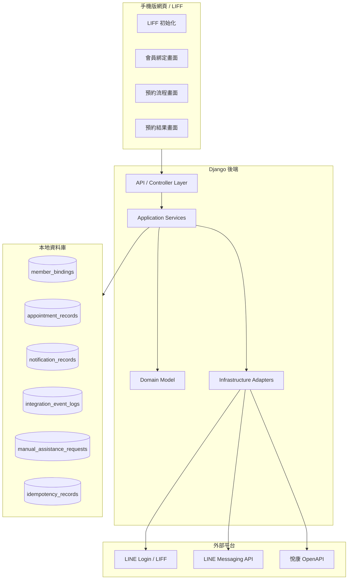
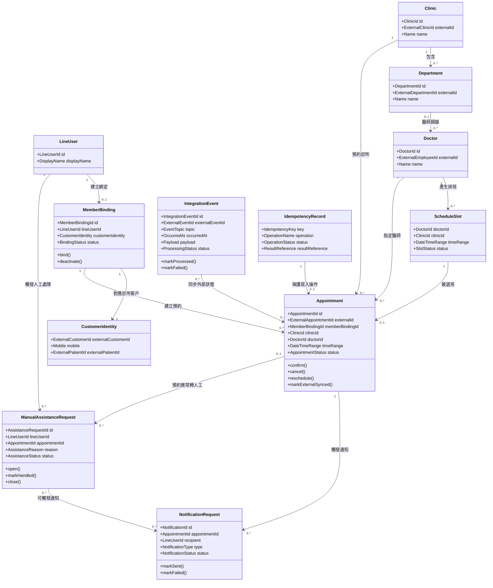
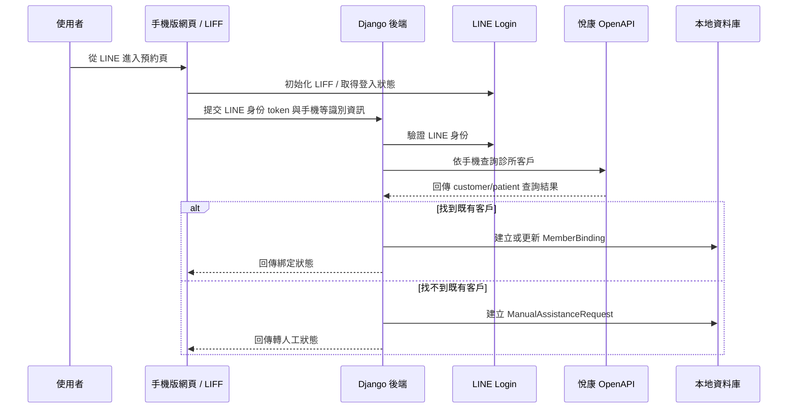
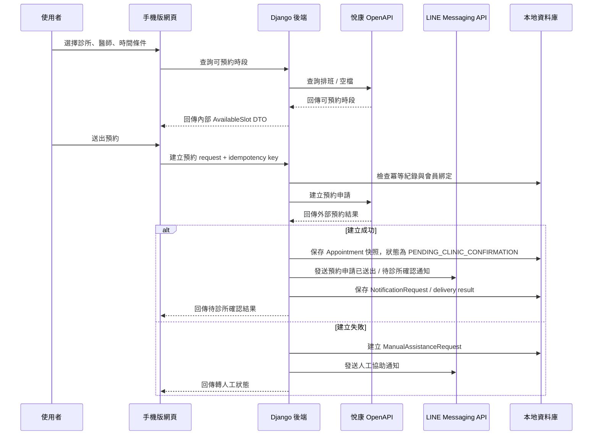
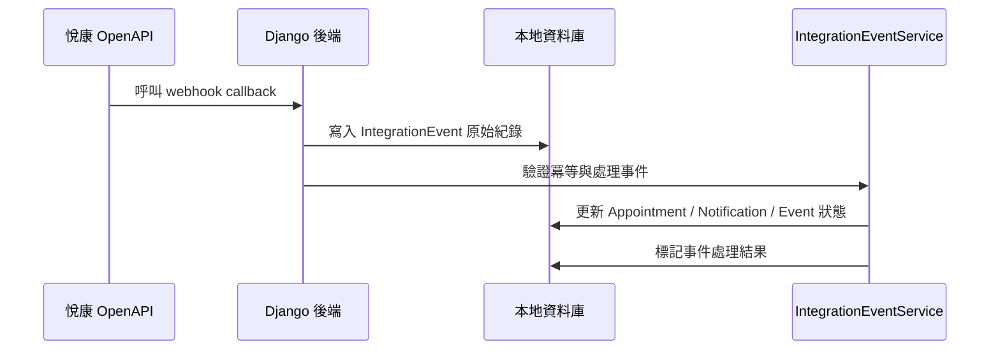

# 診所預約系統概要設計文檔

> 依據文件：`proposal.md`、`AGENT.md`  
> 初版產出日期：2026-05-19  
> 最近更新日期：2026-05-20  
> 文件狀態：概要設計草案，已納入部分待確認問題回覆  
> 設計原則：僅根據既有需求與提案內容推導；未確認事項一律標示為「待確認」，不作為既定需求。

## 1. 文件目的

本文根據 `proposal.md` 將診所預約系統拆分為主要模組、DDD bounded context、類別與核心物件，並描述它們之間的關係。本文不是正式 PRD、報價文件或資料庫詳細設計，而是後續 PoC、技術規格、測試設計與開發 backlog 的前置架構基準。

本次更新另外納入 `AGENT.md` 新增的 Clean Code 原則，以及 `## 16. 待確認事項` 中已回覆的產品與維運決策。

## 2. 已知需求摘要

| 類別 | 已知內容 | 設計影響 |
| --- | --- | --- |
| 產品型態 | 手機版網頁，不做原生 App；第一版以 LINE 入口為主 | 前端以 mobile-first、LINE 內開啟體驗為優先；一般瀏覽器獨立入口不列入已確認範圍 |
| 入口與通知 | 需要 LINE API | LINE 入口、會員綁定、通知需列入第一版架構 |
| 核心功能 | 使用者可選診所、醫師、時間並建立預約；查空檔不需登入或完成綁定 | 空檔查詢可匿名或未綁定進行；建立預約仍依會員綁定與客戶識別流程設計 |
| 預約營運 | 預約需要診所人工確認；找不到既有客戶或預約失敗時需轉人工 | 預約狀態需包含待診所確認；系統需有人工協助請求與追蹤模型 |
| 第三方系統 | 需串接悅康 OpenAPI，尤其醫師排班與預約 | 需 adapter 隔離外部 schema，不讓外部欄位滲透 domain |
| 使用規模 | 約 3,000 到 4,000 人 | 流量不大，但要重視可追蹤、補償與重試 |
| 技術限制 | Python + Node.js；專案說明指定後端 Django、uv、mypy、ruff、pytest | 後端以 Django 作為 application/API 層；Node.js 角色待確認 |
| 開發方式 | 遵循 Clean Code、DDD，並確保每個對象都有完整覆蓋測試 | 需明確劃分 domain object、adapter、application service 與測試邊界；類別、函式與依賴方向需保持清楚 |
| 維運責任 | 預約異常由本系統維護方處理 | 需設計可追蹤的異常紀錄、人工協助流程與維運查詢能力 |

## 3. 範圍邊界

### 3.1 已確認設計決策

- 第一版以 LINE / LIFF 作為主要預約入口；一般瀏覽器獨立入口目前不列入已確認範圍。
- 使用者查詢空檔不需要先登入或完成會員綁定。
- 建立預約後需進入診所人工確認流程，不直接視為最終成功到診預約。
- 找不到既有客戶時轉人工處理，不在此階段自行建立新客戶。
- 預約失敗時需要人工客服流程，但實際流程與文案仍待定義。
- 改期能力需要保留；取消與改期的截止時間仍待確認。
- 預約異常由本系統維護方處理，因此系統需保留可追蹤紀錄。
- 程式設計需遵循 Clean Code 與 DDD，並以測試保護每個核心對象。

### 3.2 本概要設計包含

- 手機版網頁與 LINE/LIFF 入口的系統邊界。
- 會員身份綁定、診所與醫師查詢、排班與空檔查詢、預約、通知、人工協助、整合事件等 bounded context。
- 主要 application service、domain model、gateway、adapter 與 repository 關係。
- 概念性資料模型與測試策略。
- 已知外部整合點、已確認決策與待確認事項。

### 3.3 本概要設計不包含

- 最終 UI 視覺設計與互動細節。
- 正式 URL、資料庫 schema、index、migration 細節。
- 悅康 API 實際欄位對應表。
- LINE channel、LIFF app、官方帳號實際設定。
- 報價、時程與維運 SLA。
- 病歷、財務、庫存等延伸模組的完整設計。

## 4. 系統總覽

### 4.1 外部參與者與系統

| 參與者 / 系統 | 角色 |
| --- | --- |
| 使用者 | 第一版從 LINE 入口進入預約流程；可未綁定先查詢空檔，建立預約時再完成必要識別與綁定 |
| LINE / LIFF | 手機版網頁入口與 LINE 使用者情境來源 |
| LINE Login | 取得可驗證的 LINE 使用者身份 |
| LINE Messaging API | 發送預約申請已送出、診所確認成功、取消、改期、提醒、失敗協助等通知 |
| 診所預約系統後端 | 本系統核心，負責 application service、domain rules、adapter、紀錄、人工協助與補償 |
| 悅康 OpenAPI | 第三方診所營運平台，提供診所、醫師、排班、空檔、預約、客戶與事件資料 |
| 本地資料庫 | 保存本系統責任內的綁定、預約快照、通知紀錄、事件紀錄、冪等紀錄 |

### 4.2 架構概念圖

## 5. 分層設計

| 層級 | 責任 | 不應負責 |
| --- | --- | --- |
| Client / Mobile Web | LIFF 初始化、流程畫面、表單輸入、呼叫後端 API | 不直接信任前端傳入的 LINE user id；不直接呼叫悅康 API |
| API / Controller Layer | 接收 HTTP request、驗證輸入格式、呼叫 application service、轉換 response | 不放業務規則、不直接依賴悅康 schema |
| Application Services | 編排用例流程、交易邊界、呼叫 domain、repository、gateway | 不實作外部 HTTP 細節，不放 UI 邏輯 |
| Domain Model | 表達預約、綁定、通知、事件等核心狀態與規則 | 不知道 Django、資料庫、HTTP、LINE、悅康 |
| Infrastructure Adapters | 實作 YuekangClient、LINE API client、repository、event receiver | 不改寫 domain 規則，不讓外部欄位成為 domain API |
| Local Persistence | 保存本系統需要追蹤、人工處理與補償的資料 | 不取代悅康作為診所營運主資料來源，除非未來需求另行確認 |

## 6. Bounded Context 劃分

| Context | 核心責任 | 主要物件 | 主要外部依賴 |
| --- | --- | --- | --- |
| Member Identity | 建立 LINE 使用者、手機、悅康 customer/patient 的綁定 | `LineUser`、`MemberBinding`、`CustomerIdentity` | LINE Login、悅康 CRM customer API |
| Clinic Directory | 查詢診所、科室、醫師、治療室等基礎資料 | `Clinic`、`Department`、`Doctor`、`TreatmentRoom` | 悅康 foundation API |
| Scheduling | 查詢醫師排班、可預約時段與空檔 | `ScheduleSlot`、`AvailabilityQuery`、`AvailableSlot` | 悅康 schedule/free-list API |
| Appointment | 建立、取消、確認、改期預約，維護本地預約快照與狀態規則 | `Appointment`、`AppointmentStatus`、`AppointmentCommand` | 悅康 appointment API、本地 repository |
| Notification | 管理 LINE 通知請求、發送結果、重試紀錄 | `NotificationRequest`、`NotificationDelivery`、`NotificationStatus` | LINE Messaging API |
| Manual Assistance | 管理找不到客戶、預約失敗、預約異常等人工處理入口與追蹤 | `ManualAssistanceRequest`、`AssistanceReason`、`AssistanceStatus` | 本地 repository、Notification |
| Integration Events | 接收 webhook、保存 event log、處理冪等與 replay | `IntegrationEvent`、`EventSubscription`、`ReplayCursor` | 悅康 event API、本地 event log |
| Visit & Care | 到診、諮詢、診療流程 | 待需求確認 | 待需求確認 |
| Billing & Records | 訂單、收款、病歷、庫存 | 待需求確認 | 悅康相關 API，待需求確認 |

## 7. 模組設計

### 7.1 Client 模組

| 模組 | 責任 | 備註 |
| --- | --- | --- |
| `LiffBootstrap` | 初始化 LIFF、檢查 LINE 入口情境、取得前端可用 token | 第一版以 LINE 入口為主；後端仍需驗證身份，不直接信任前端 user id |
| `BindingFlow` | 引導使用者輸入手機或診所要求的識別資訊 | 找不到既有客戶時轉人工，不自行建立新客戶 |
| `ClinicDoctorSelection` | 顯示診所、科室、醫師選擇 | 資料由後端 adapter 查詢，不直接依賴悅康 response |
| `SlotPicker` | 顯示可預約時段 | 查空檔不需登入或完成綁定；時區、時間格式需測試保護 |
| `AppointmentConfirm` | 送出建立預約請求，避免重複送出 | 需搭配後端冪等鍵；送出後進入待診所人工確認 |
| `AppointmentResult` | 顯示待確認、失敗、需人工協助等結果 | 失敗文案與人工流程待確認 |

> Node.js 的實際角色在既有需求中尚未明確。本文只確認手機版網頁需要前端工程；是否使用 Node.js 作為 BFF、SSR 或僅作為前端工具鏈，待技術選型時確認。

### 7.2 Backend Application 模組

| Application Service | 責任 | 主要協作者 |
| --- | --- | --- |
| `MemberBindingService` | 驗證 LINE 身份、依手機查詢悅康 customer、建立或讀取綁定 | `LineIdentityGateway`、`CustomerGateway`、`MemberBindingRepository` |
| `ClinicDirectoryService` | 查詢診所、科室、醫師等基礎資料並轉成內部 DTO | `ClinicDirectoryGateway` |
| `SchedulingService` | 查詢排班與空檔，轉成可供前端顯示的可預約時段 | `SchedulingGateway` |
| `AppointmentService` | 建立預約申請、取消、確認、改期預約；維護本地狀態與冪等；送出後以待診所確認為主 | `AppointmentGateway`、`AppointmentRepository`、`IdempotencyRepository` |
| `NotificationService` | 建立通知請求、發送 LINE 訊息、記錄結果與重試狀態 | `LineMessagingGateway`、`NotificationRepository` |
| `ManualAssistanceService` | 建立並追蹤找不到客戶、預約失敗、預約異常等人工處理請求 | `ManualAssistanceRepository`、`NotificationService` |
| `IntegrationEventService` | 接收 webhook、寫入 event log、處理重複事件與補償 | `EventGateway`、`IntegrationEventRepository`、`IdempotencyRepository` |

### 7.3 Infrastructure Adapter 模組

| Adapter / Gateway | 責任 |
| --- | --- |
| `YuekangClient` | 基礎 HTTP client，集中處理 token、refresh、錯誤碼、request id、log、重試 |
| `YuekangAuthGateway` | 封裝 `POST /api/v1/auth/login` 與 `POST /api/v1/auth/refresh` |
| `YuekangClinicDirectoryGateway` | 封裝診所、員工、科室、組織等查詢 |
| `YuekangCustomerGateway` | 封裝手機查客戶與客戶綁定相關查詢 |
| `YuekangSchedulingGateway` | 封裝排班與空檔查詢 |
| `YuekangAppointmentGateway` | 封裝建立、取消、確認、改期預約 |
| `YuekangEventGateway` | 封裝 topic、subscribe、event-history 與 webhook 相關能力 |
| `LineIdentityGateway` | 驗證 LINE Login / LIFF 身份資料 |
| `LineMessagingGateway` | 封裝 Messaging API，發送預約相關通知 |

## 8. 核心類別與物件設計

### 8.1 類別關係圖

### 8.2 Aggregate 與 Entity

| 類別 | 類型 | 責任 | 測試重點 |
| --- | --- | --- | --- |
| `MemberBinding` | Aggregate Root | 管理 LINE user 與悅康 customer/patient 的綁定狀態 | 不可重複綁定、停用後不可用於新預約 |
| `Appointment` | Aggregate Root | 管理預約生命週期與狀態轉換 | 未綁定不可建立預約、已取消不可再次取消、待診所確認與已確認需觸發不同通知 |
| `NotificationRequest` | Aggregate Root | 管理通知請求、發送狀態、失敗重試 | 成功/失敗狀態轉換、重試次數、錯誤紀錄 |
| `ManualAssistanceRequest` | Aggregate Root | 管理人工處理請求與處理狀態 | 找不到客戶、預約失敗、異常預約需可追蹤且不可遺失 |
| `IntegrationEvent` | Entity / Event Log Record | 保存外部事件、處理狀態與 replay 資訊 | 相同 external event 不可重複處理、失敗可重試 |
| `Clinic`、`Department`、`Doctor` | Entity / Read Model | 表達可查詢的診所基礎資料 | 外部資料轉換、缺漏欄位處理 |

### 8.3 Value Object

| Value Object | 用途 | 規則 |
| --- | --- | --- |
| `LineUserId` | LINE 使用者唯一識別 | 不可為空；來源需經可信流程驗證 |
| `ExternalCustomerId` | 悅康 customer id | 不假設格式，僅保留外部識別 |
| `ExternalAppointmentId` | 悅康 appointment id | 寫入操作完成後保存，用於同步與取消 |
| `Mobile` | 手機號碼 | 格式規則待確認；不可在未確認前強綁特定國碼規則 |
| `DateTimeRange` | 預約或排班時間區間 | start 必須早於 end；時區策略需測試 |
| `IdempotencyKey` | 寫入操作冪等鍵 | 同一 operation 內唯一，用於防止重複預約或重複 callback |
| `RequestTraceId` | 跨系統追蹤 id | 用於 log、外部 request 與錯誤排查 |

### 8.4 Enum / 狀態

| Enum | 建議狀態 | 備註 |
| --- | --- | --- |
| `BindingStatus` | `ACTIVE`、`INACTIVE` | 是否允許用於預約 |
| `AppointmentStatus` | `DRAFT`、`PENDING_EXTERNAL`、`PENDING_CLINIC_CONFIRMATION`、`CONFIRMED`、`CANCELLED`、`RESCHEDULED`、`FAILED`、`MANUAL_ASSISTANCE_REQUIRED` | 建立後需待診所人工確認；最終狀態仍需依悅康狀態流轉確認 |
| `NotificationType` | `APPOINTMENT_REQUESTED`、`APPOINTMENT_CONFIRMED`、`APPOINTMENT_CANCELLED`、`APPOINTMENT_RESCHEDULED`、`APPOINTMENT_REMINDER`、`MANUAL_ASSISTANCE_REQUIRED` | 第一版需支援待確認、確認、取消、改期、提醒與人工協助通知 |
| `NotificationStatus` | `PENDING`、`SENT`、`FAILED`、`RETRYING`、`GAVE_UP` | 需保存錯誤訊息與重試次數 |
| `AssistanceReason` | `CUSTOMER_NOT_FOUND`、`APPOINTMENT_FAILED`、`APPOINTMENT_EXCEPTION` | 人工處理原因需結構化，方便維運方追蹤 |
| `AssistanceStatus` | `OPEN`、`HANDLING`、`RESOLVED`、`CANCELLED` | 人工處理流程的實際 SLA 與處理角色待確認 |
| `ProcessingStatus` | `RECEIVED`、`PROCESSED`、`FAILED`、`SKIPPED_DUPLICATE` | 用於 webhook 與 event-history |

## 9. 主要用例流程

### 9.1 會員綁定流程

設計約束：

- 後端不得直接信任前端傳入的 `lineUserId`。
- 手機或其他識別欄位的實際規則待確認。
- 找不到客戶時需轉人工處理，不在本流程中自行建立新客戶。

### 9.2 查詢空檔與建立預約流程

設計約束：

- 查詢空檔不要求使用者先登入或完成綁定。
- 同一個建立預約操作需要冪等保護，避免使用者重複點擊造成重複預約。
- 建立預約後先進入 `PENDING_CLINIC_CONFIRMATION`，待診所人工確認後才進入確認狀態。
- 通知發送失敗不應直接改變預約申請結果，但必須可追蹤與重試。
- 預約建立失敗需建立人工協助請求。

### 9.3 Webhook 與事件補償流程

設計約束：

- webhook 簽名、重試、保序規則待確認。
- `event-history` 應用於補償漏接事件，但保留多久與查詢條件待確認。
- callback payload 不應直接覆寫 domain 狀態，需經 `IntegrationEventService` 轉換與驗證。

## 10. 概念性資料模型

> 本節是本地資料庫概念設計，不是正式 migration。實際欄位需在 API 欄位與隱私責任確認後再定稿。

| 表 / 儲存模型 | 用途 | 關鍵欄位 |
| --- | --- | --- |
| `member_bindings` | 保存 LINE user 與悅康 customer/patient 的綁定 | `id`、`line_user_id`、`external_customer_id`、`mobile_hash_or_masked`、`status`、`created_at`、`updated_at` |
| `appointment_records` | 保存本地預約快照與狀態 | `id`、`external_appointment_id`、`member_binding_id`、`clinic_id`、`doctor_id`、`start_at`、`end_at`、`status`、`raw_external_ref` |
| `notification_records` | 保存 LINE 通知請求與發送結果 | `id`、`appointment_id`、`line_user_id`、`type`、`status`、`line_request_id`、`error_message`、`retry_count` |
| `manual_assistance_requests` | 保存找不到客戶、預約失敗、預約異常等人工處理請求 | `id`、`line_user_id`、`appointment_id`、`reason`、`status`、`note`、`created_at`、`handled_at` |
| `integration_event_logs` | 保存 webhook 與 event-history 事件 | `id`、`external_event_id`、`topic`、`payload`、`status`、`occurred_at`、`processed_at` |
| `idempotency_records` | 防止重複寫入與重複事件處理 | `key`、`operation`、`status`、`result_reference`、`created_at`、`expires_at` |
| `api_request_logs` | 跨系統排錯與追蹤 | `trace_id`、`target_system`、`operation`、`status_code`、`duration_ms`、`error_code` |

隱私設計注意事項：

- 手機號與個資是否明文保存需另行確認；若非必要，優先保存遮罩或 hash。
- 病歷、財務、庫存若進入本系統，需升級安全與權限設計。
- 外部 API 原始 payload 是否完整保存需評估個資風險與除錯需求。

## 11. 對外 API 與用例接口

以下是後端應支援的用例接口方向，不是最終 URL 設計。

| 用例 | 輸入 | 輸出 | 對應 Application Service |
| --- | --- | --- | --- |
| 取得綁定狀態 | LINE 身份 token | 是否已綁定、綁定摘要 | `MemberBindingService` |
| 建立會員綁定 | LINE 身份 token、手機或識別資訊 | 綁定結果 | `MemberBindingService` |
| 查診所 / 醫師 | 查詢條件 | 診所、科室、醫師清單 | `ClinicDirectoryService` |
| 查可預約時段 | 診所、醫師、日期條件 | 可預約時段清單 | `SchedulingService` |
| 建立預約 | 綁定身份、時段、冪等鍵 | 預約申請結果，成功時為待診所確認 | `AppointmentService` |
| 轉人工處理 | LINE 身份、原因、預約或查客戶上下文 | 人工處理請求 | `ManualAssistanceService` |
| 取消預約 | 預約 id、冪等鍵 | 取消結果 | `AppointmentService` |
| 確認預約 | 預約 id、冪等鍵 | 確認結果 | `AppointmentService` |
| 接收 webhook | 外部事件 payload | 接收結果 | `IntegrationEventService` |

## 12. 悅康 OpenAPI 整合設計

### 12.1 優先對接能力

| 能力 | 悅康端點 |
| --- | --- |
| 取得 token | `POST /api/v1/auth/login` |
| 刷新 token | `POST /api/v1/auth/refresh` |
| 查診所 | `GET /api/v1/foundation/clinic` |
| 查員工 / 醫師 | `GET /api/v1/foundation/employee` |
| 查排班 | `GET /api/v1/workflow/schedule` |
| 查預約空檔 | `POST /api/v1/workflow/appointment/getAppointmentFreeList` |
| 建立預約 | `POST /api/v1/workflow/appointment` |
| 取消預約 | `PUT /api/v1/workflow/appointment/{id}/cancel` |
| 確認預約 | `PUT /api/v1/workflow/appointment/{id}/confirm` |
| 手機查客戶 | `GET /api/v1/crm/customer/findByMobile` |
| 事件 topic | `GET /api/v1/event/topic` |
| 建立事件訂閱 | `POST /api/v1/event/subscribe` |
| 查歷史事件 | `GET /api/v1/event/event-history` |

### 12.2 Adapter 設計原則

- `YuekangClient` 統一處理 token、refresh、timeout、request id、log、錯誤轉換。
- 各 context 透過 gateway interface 依賴悅康，不直接依賴 HTTP client。
- 外部 response 需先轉成內部 DTO 或 domain value object。
- 寫入型操作需有冪等策略，即使悅康 API 不支援冪等鍵，本地仍要防止同一請求重複送出。
- webhook 與 `event-history` 都要落本地 event log。

## 13. LINE API 整合設計

| 能力 | 建議 LINE 產品 | 系統責任 |
| --- | --- | --- |
| LINE 入口 | LIFF | 提供手機版預約入口與 LINE 內使用情境 |
| 會員綁定 | LINE Login | 取得並驗證 LINE 使用者身份 |
| 預約通知 | Messaging API | 發送預約申請已送出、診所確認成功、取消、改期、提醒、人工協助通知 |

設計約束：

- 不使用 LINE Notify。`proposal.md` 已明確指出 LINE Notify 於 2025-03-31 結束服務。
- LINE 使用者封鎖官方帳號、發送失敗、channel 權限不足等情況需被記錄。
- 通知模板是否使用 Flex Message、是否需要 rich menu，待確認。

## 14. 錯誤處理、冪等與補償

| 場景 | 設計策略 |
| --- | --- |
| 使用者重複送出預約 | 前端避免重複點擊，後端以 `IdempotencyKey` 保護寫入操作 |
| 找不到既有客戶 | 建立 `ManualAssistanceRequest`，不自行建立新客戶 |
| 悅康建立預約成功但本地保存失敗 | 需以 trace id 與外部 appointment id 補償；實作前需定義交易與重試策略 |
| 本地保存成功但通知失敗 | 預約申請仍保留，通知進入 `FAILED` 或 `RETRYING`，可重試或人工處理 |
| webhook 重複送達 | 以 `external_event_id` 或 payload 指紋做冪等判斷 |
| webhook 漏接 | 使用 `event-history` replay 補償 |
| token 過期 | `YuekangClient` 統一 refresh，避免各 adapter 自行處理 |
| 第三方 API 當機 | 建立可追蹤的人工協助或稍後重試紀錄；實際顯示文案待確認 |

## 15. 測試策略

| 測試類型 | 覆蓋對象 | 重點 |
| --- | --- | --- |
| Domain unit test | `MemberBinding`、`Appointment`、`NotificationRequest`、`ManualAssistanceRequest`、`IntegrationEvent` | 狀態轉換、不可變規則、重複處理 |
| Application service test | 各 use case service | 編排流程、交易邊界、錯誤分支、冪等、轉人工 |
| Contract test | Yuekang gateway、LINE gateway | 外部 schema 假設、錯誤碼轉換、timeout |
| Integration test | token、查排班、建預約、發通知、webhook | 真實串接或 sandbox 串接 |
| Webhook test | `IntegrationEventService` | 重複事件、失敗重試、event-history replay |
| E2E smoke test | LIFF 入口到預約完成 | 核心流程能否完整走通 |

測試優先順序：

1. `Appointment` 狀態機、待診所確認與冪等。
2. `MemberBinding` 綁定規則，以及找不到客戶時轉人工。
3. 查空檔不需登入或綁定的 application service 測試。
4. Yuekang adapter contract。
5. LINE notification 發送紀錄與失敗處理。
6. `ManualAssistanceRequest` 建立與狀態轉換。
7. webhook 重複事件與補償。

### 15.1 Clean Code 與可測試性約束

- Domain object 優先保持純粹，不直接依賴 Django model、HTTP client、LINE SDK 或悅康 response schema。
- Application service 以單一用例為邊界，避免把會員綁定、查空檔、建立預約、通知與人工協助混成單一大型 service。
- Gateway interface 由 application/domain 需要定義，infrastructure adapter 負責實作，保持依賴方向清楚。
- 有狀態轉換的對象需把規則收斂在方法內，例如 `Appointment.cancel()`、`Appointment.reschedule()`、`ManualAssistanceRequest.markHandled()`。
- 每個核心對象的測試需覆蓋成功路徑、非法狀態轉換、冪等或重複處理、外部失敗造成的補償分支。

## 16. 已回答事項與待確認事項

### 16.1 已回答並納入設計的事項

| 問題 | 回覆 | 設計落點 |
| --- | --- | --- |
| 使用者是否只能從 LINE 進入，或也允許一般瀏覽器進入？ | 是 | 本文件採用「第一版以 LINE / LIFF 入口為主；一般瀏覽器獨立入口不列入已確認範圍」作為設計基準 |
| 預約是否需要登入或完成綁定後才能查空檔？ | 不用 | `SchedulingService` 支援未登入 / 未綁定查空檔；建立預約時再進入識別與綁定流程 |
| 預約是否需要診所人工確認？ | 是 | `AppointmentStatus` 新增 `PENDING_CLINIC_CONFIRMATION`，預約申請不直接等同最終確認 |
| 使用者可以取消或改期到什麼時間點？ | 待確認，但保留改期能力 | 設計保留 `reschedule()` 與取消 / 改期用例，但截止時間規則暫不寫死 |
| 找不到既有客戶時如何處理？ | 轉人工 | 建立 `ManualAssistanceRequest`，不自行建立新客戶 |
| 預約失敗時是否需要人工客服流程？ | 是，但需定義流程與文案 | 預約失敗建立人工協助請求，通知與畫面文案待定 |
| 預約異常由誰處理？ | 本系統維護方 | 系統需保存異常紀錄、人工處理狀態與可追蹤資訊 |

### 16.2 產品流程仍待確認

- 一般瀏覽器是否需要 fallback 頁面，或完全不提供入口。
- 建立預約前是否一定要完成 LINE 與悅康客戶綁定；目前設計採用建立預約時需完成必要識別。
- 取消與改期的截止時間。
- 預約失敗與轉人工的實際客服流程、負責角色、通知文案與 SLA。
- 診所人工確認後如何回寫狀態：由 webhook、人工後台、悅康狀態查詢，或其他方式。

### 16.3 悅康 API

- 正式環境 base URL、IP 白名單、憑證交付方式。
- token 有效期與 refresh 規則。
- 預約 API 是否支援冪等鍵；若重複送出會如何處理。
- 空檔查詢是否已包含醫師休假、治療室、服務項目時長。
- 取消、確認、改期的狀態流轉規則。
- webhook 是否有簽名、重試、保序與 event-history 保留期限。

### 16.4 LINE API

- 是否已有 LINE Official Account、Messaging API channel、LINE Login channel。
- LIFF app 要掛在哪個 LINE Login channel。
- 是否需要 rich menu 作為預約入口。
- 通知是否需要 Flex Message 模板。
- 使用者封鎖官方帳號時的處理方式。

### 16.5 維運與資料責任

- 正式上線後是否需要後台查詢預約、通知紀錄與人工協助請求。
- 個資、病歷、財務資料是否會進入本系統。
- 本地資料保存期限、刪除規則與稽核需求。

## 17. 後續建議產物

- `docs/api-capability-map.md`：整理第一階段必驗證悅康端點與問題。
- `docs/domain-model.md`：細化 `Appointment`、`MemberBinding`、`NotificationRequest`、`ManualAssistanceRequest`、`IntegrationEvent`。
- `docs/poc-plan.md`：定義 token、排班、建立測試預約、LINE 通知的 PoC 驗收標準。
- `docs/testing-strategy.md`：建立 domain、contract、integration、webhook、E2E smoke test 規格。
- `docs/open-questions.md`：整理要問學長、診所或悅康廠商的問題。

## 18. 結論

本系統的核心不是單一預約表單，而是「LINE 身份綁定 + 悅康排班預約 + 診所人工確認 + 人工協助 + 通知可靠性 + 事件同步補償」的整合系統。概要設計應先保護以下幾個邊界：

- Domain 不依賴 Django、LINE 或悅康 schema。
- Application service 負責用例編排與交易邊界。
- Gateway / adapter 隔離第三方 API。
- 本地資料只保存本系統需要追蹤、補償與測試保護的資料。
- 未確認的產品流程與第三方規則不寫死在 domain model 中。
- Clean Code 是實作約束：保持小而清楚的類別與函式、明確命名、單一職責、依賴反轉與可測試性。

在需求正式落地前，建議優先完成 PoC 與問題釐清，再進入正式功能開發。
