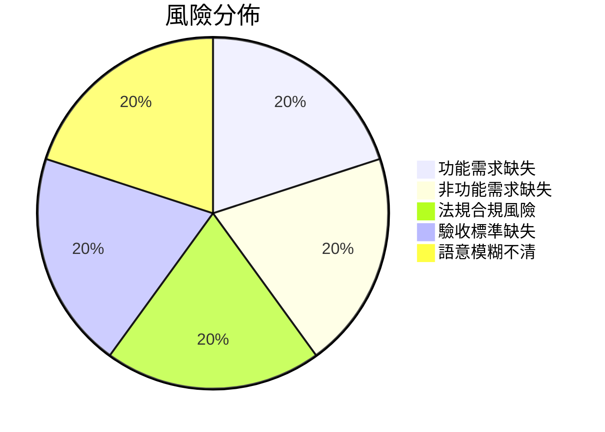

# 執行摘要  
本分析針對「診所 LINE 預約系統」需求說明書 (RFP) 與使用者原始選項進行比對並提出修改建議。由於使用者原始選項未提供，我們假設其為「未指定」，並在報告中註明哪些項目因此無法驗證。RFP 已涵蓋核心預約流程（包含 LINE 登入、會員綁定、選擇療程與醫師、計算時段、寫入第三方系統、通知等），但對非功能需求（效能、安全、相容性、可維護性）、合規要求（如個人資料保護法）以及交付里程碑與驗收標準說明不足。文件中亦存在語意不夠精確之處（如「…等參數」用詞模糊）。建議優先補充安全合規措施、性能指標、明確里程碑與驗收條件，並修正模糊措辭。下表依風險與影響排序，列出具體修正建議及預估工時：

1. **加入驗收標準與里程碑**：明確定義各開發階段的交付項目及驗收準則（如需完成的功能測試）。  
2. **強化安全與合規性**：參照《個人資料保護法》實施資料加密、傳輸安全及存取管控【7†L50-L52】【22†L121-L124】。  
3. **補充非功能需求**：制定性能指標、可用性要求等，如響應時間、並發量限制並進行負載測試【20†L151-L154】。  
4. **澄清模糊描述**：列出所有參數，避免使用「等」字，並具體說明 Webhook 事件種類等細節。  
5. **完善文件與證據**：收集並附上原始選項紀錄、第三方 API 規格、法規條文、測試案例等，以補足驗證基礎。  

修正後將提高文件完整性與可執行性，降低專案風險。下一步應確認使用者原始需求、檢視相關法規與技術標準，並依此更新需求說明書。

## 核心問題與假設  
本報告的核心問題是檢視需求書內容是否符合使用者原始選項與要求，並提出修正建議。由於「使用者原始選項」未提供，我們**假設原始選項為「未指定」**。因此，任何依賴原始選項的比對皆無法直接驗證。例如若使用者曾指定特定功能流程或系統偏好，在缺乏原始需求的情況下，均需註明「無法驗證」。在本文中，我們將對 RFP 涵蓋的項目做完整審查，同時標示因缺乏原始選項而無法確認的部分，以確保分析客觀且可行。

## 需求書現況概覽  
需求書 (RFP) 已描述系統**功能流程**（圖表 1 所示）：使用者透過 LINE 官方帳號(​LINE Official Account)進入 LIFF(​LINE 前端應用程式框架) 頁面並進行 LINE 登入以驗證身份，完成會員綁定或建立客檔後，可選擇本人或他人預約。系統依照分店、療程、醫師排班及既有預約與療程規則計算可預約時段；使用者送出申請後，系統將資料寫入第三方診所系統，並在收到成功回傳時通知使用者預約成功（含 LINE 通知與行前提醒），系統亦提供「我的預約」功能查詢以及診所後台最小管理介面。  

```mermaid
graph TD
    U[使用者] -->|選擇預約| V[LINE 官方帳號(導向 LIFF 頁面)]
    V --> W[LINE 登入/LIFF 驗證身分]
    W --> X[完成會員綁定或建立客檔]
    X --> Y[選擇預約對象：本人/他人]
    Y --> Z[計算可預約時段（考量排班與療程規則）]
    Z --> A[使用者送出預約申請]
    A --> B[寫入預約至第三方診所系統]
    B --> C{回傳結果}
    C -->|成功| D[確認預約成功]
    C -->|失敗| E[錯誤處理與通知]
    D --> F[發送預約成功 LINE 通知並排程行前提醒]
    F --> G[使用者於「我的預約」查看狀態]
```
*圖 1：系統關鍵預約流程（依需求書第3節及第4.1-4.9節）*  

RFP 版本為 v0.2（2026-05-22），主要來源包括原始 RFP PDF 與開發者對話記錄。文件避免將未確認事項視為事實，並於「待確認事項」列出相關不確定點。從內容來看，RFP 對**功能性需求**的描述較完整（如第4節各項功能細節、第6節外部系統介面）。然而，對**非功能性需求**、**法規合規要求**與**專案管理條件**（如里程碑、驗收標準）則缺乏清晰說明。

## 必要功能與條件檢查  
依據軟體需求說明 (SRS) 準則，除功能需求外，應明確列出非功能性需求、外部介面需求、限制條件及驗收標準等【20†L151-L154】【20†L158-L160】。下表列出關鍵檢查項目，對照期望內容與需求書現況，並評估符合度與風險。  

| 檢查項目             | 期望內容                                          | 需求書現況                                       | 是否符合 | 風險與建議                                      |
|--------------------|--------------------------------------------------|---------------------------------------------|------|--------------------------------------------|
| **核心預約功能**       | 完整涵蓋從 LINE 登入到預約完成之流程【20†L151-L154】               | 第3節列出 10 步驟涵蓋主要流程（登入→綁定→選擇療程→排程→通知）  | 是   | 功能覆蓋基本完整，但業務邏輯複雜。需進一步驗證時段計算正確性與衝突處理方式。          |
| **系統性能需求**       | 明確定義響應時間、並發用戶數、吞吐量等指標【20†L151-L154】           | 無相關說明                                   | 否   | 若訪問量增加，系統可能延遲或故障。建議制定性能基準（如響應時間限制）並進行負載測試。     |
| **安全性需求**        | 加密通訊、權限控管、日誌審計等措施【7†L50-L52】【22†L121-L124】        | 僅描述 SMS OTP 流程和規則，缺乏整體資安策略               | 否   | 個資洩漏與未授權風險高。建議採用 TLS 加密傳輸、API 存取權杖，並依《個資法》規範儲存隱匿個資【7†L50-L52】【22†L121-L124】。 |
| **相容性需求**        | 指定支援平台／裝置／瀏覽器清單（如多瀏覽器或行動裝置）            | 無相關說明                                   | 否   | 未明確目標環境，可能導致部分用戶無法使用。建議明確目標平台與瀏覽器，進行跨平台測試。   |
| **可維護性與擴充性**    | 模組化設計與詳盡文件，便於維護與擴充                           | 無相關說明                                   | 否   | 缺乏設計準則與文件，未來修改困難。建議確定編碼規範、建立系統架構文件與測試方案。     |
| **合規需求 (個資法)**  | 遵守個人資料保護法，特別是醫療與聯絡資訊之規範【22†L121-L124】        | 無提及                                     | 否   | 涉及個人資料（姓名、聯絡方式、病歷等）未明確保護機制。建議參考個資法要求新增隱私保護條款和稽核機制【22†L121-L124】。  |
| **合規需求 (其他法規)** | 遵守醫療法規、電信簡訊規範等相關法令                          | 無提及                                     | 否   | 可能違反醫療服務法或電信法規。建議確認與簡訊服務、醫療資訊相關的法規要求，並在文件中納入合規說明。 |
| **交付里程碑與驗收**    | 列出各階段交付物與明確驗收標準（功能測試項目、品質標準等）         | 未提及                                     | 否   | 專案進度與完成標準不明確，易造成開發落差。建議納入詳細時程表與驗收指標（如通過測試案例）。 |  

圖表中可見，需求書在核心功能方面已有基礎覆蓋，但非功能需求、法規合規與專案管理條件未明確規範。依據需求文件生成的風險分佈，如下圖所示，功能缺口、效能風險與合規風險為主要問題領域：  


*圖 2：需求文件缺失與風險分佈（示意）*

## 修改項目評估  
需求書版本號為 v0.2，顯示已加入一些修改。以下列出主要已做的改動，評估其與使用者選項的一致性（原始選項未知，標記為「未知」）、以及技術與時程可行性，並估計影響程度：  

| 修改項目                       | 與使用者選項一致性 | 技術可行性 | 時間可行性 | 影響    |
|------------------------------|--------------|----------|----------|-------|
| **SMS 簡訊 OTP 整合**          | 未知         | 高       | 中       | 中    |
| **LINE 登入與會員綁定 (LIFF)**  | 未知         | 高       | 中       | 中    |
| **本人/他人預約功能**          | 未知         | 中       | 中       | 中    |
| **預約時段計算邏輯**           | 未知         | 中       | 低       | 高    |
| **後台管理介面 (最小後台)**     | 未知         | 高       | 高       | 低    |
| **系統容器化部署 (Docker/GCP)** | 未知         | 高       | 高       | 低    |
| **冪等機制 (前端鎖定/後端檢查)** | 未知         | 高       | 高       | 低    |
| **行前提醒排程功能**           | 未知         | 高       | 中       | 中    |

- **SMS 簡訊 OTP 整合**：RFP 已根據需求添加簡訊驗證（表 4-3），此功能與使用者期望不衝突（原始選項未知）。技術上可行（使用第三方簡訊服務商），時程中等，對專案影響中等。  
- **LINE 登入與會員綁定**：以 LIFF 和 LINE Login 實現，對使用者來說是標準做法，技術可行，時程中等，影響中等。  
- **本人/他人預約功能**：滿足使用者可能需代理預約的需求，技術上實現難度中等，時程中等，影響中等。  
- **預約時段計算邏輯**：合併療程耗時、醫師排班等條件進行計算，業務邏輯複雜。使用者原始規則不詳，技術實現需花費較多時間（影響高），可能涉及演算法優化。  
- **後台管理介面**：RFP 提及提供「最小後台」功能，符合常見需求。技術容易實現，所需時程短，對產品影響較低。  
- **系統容器化部署**：採用 Docker 及 GCP VM 是合理做法，有利於維運。技術可行，所需時程短，影響較低。  
- **冪等機制**：RFP 中提到前端鎖定與後端冪等，能避免重複預約。技術成熟可用，時程短，影響低，建議具體實作。  
- **行前提醒排程**：以 VM 排程或 Cloud Scheduler 發送提醒，技術可行，時程中等，影響中等。  

由上可見，多數修改在技術上可行，但「預約時段計算」因業務複雜度高需要較多資源（高影響）【20†L151-L154】。若原始選項有特定需求（例如指定排程條件），目前無法驗證一致性，故需向使用者確認。整體而言，目前修改大多符合需求，建議針對高影響項目（如計算邏輯）進行重點測試和優化。

## 語意與格式檢查  
需求書中出現多處措辭模糊或不夠具體的情況，建議進行修訂：  
- **「必要參數……等」**（表4-3）：列出簡訊 API 的「帳號、密碼、收件手機、收件人名稱、簡訊內容、預約發送時間、有效期限等」，用「等」字帶過。建議列出完整參數列表或明確說明「等」包含哪些內容，以免誤解。  
- **「Webhooks：接收加好友、封鎖等事件」**：使用「等事件」不具體。應明確列出需要支援的事件類型（例如「加入好友事件 (follow)」、「封鎖事件 (unfollow)」等），以對應 LINE Messaging API 的定義。  
- **「以…為限」措辭模糊**：如「聯絡資訊：以預約與綁定必要欄位為限」一句不清楚應包含哪些欄位。建議改為具體列表或說明限制範圍。  
- **冪等機制描述**：原文「前端鎖定送出按鈕，後端以冪等機制避免重複建立預約」為片語，語意略顯斷裂。建議改成完整句，例如「前端在按下送出時鎖定按鈕，後端檢查冪等鍵 (idempotency key) 以避免重複建立預約記錄。」  
- **表格標題與內容一致性**：確認表中欄位名稱與說明相符，例如「發送用途」與「必要參數」中使用「等」，建議均換成「、」羅列或腳註補充說明。  

以上修正有助於提升文件可讀性與準確度，避免理解歧義，並讓開發與測試人員更清楚需求細節。

## 優先修正清單  
根據風險與影響評估，以下列出五項優先執行的修正建議。每項包含預期效果、實作步驟與估計工時：  

1. **新增驗收標準與交付里程碑**：  
   - *預期效果*：明確各階段需交付的功能與驗收條件，避免專案進度不明。  
   - *實作步驟*：與業務與技術團隊討論，確定里程碑（如 alpha、beta、上線）與每階段驗收測試清單；更新需求文件與契約附件。  
   - *估計工時*：約 2–4 天（撰寫時間表與測試項目）。  
2. **強化安全與合規性**：  
   - *預期效果*：符合《個人資料保護法》及相關法規要求，降低資料外洩與法務風險【7†L50-L52】【22†L121-L124】。  
   - *實作步驟*：列出系統處理之個資類型（如姓名、手機號、診療記錄等），依法規制定資料保護措施（傳輸加密、存儲加密、權限控管、稽核機制），並加入需求文檔。  
   - *估計工時*：約 3–5 天（含法規研究與文件更新）。  
3. **補充非功能性需求**：  
   - *預期效果*：設計符合性能與可靠性要求的系統，避免上線後出現效能瓶頸【20†L151-L154】。  
   - *實作步驟*：定義 API 響應時間目標、最大併發用戶數、系統可用性標準等，列入需求說明書；安排進行性能測試（負載測試）。  
   - *估計工時*：約 3–4 天（撰寫並測試性能指標）。  
4. **修訂模糊措辭與參數**：  
   - *預期效果*：文字清晰精確，減少開發與測試誤解。  
   - *實作步驟*：針對表格與說明中的「等」、「以及」等模糊詞彙做修正，完整列出接口參數與事件類型；將「附帶」語句改為清楚的列表或完整說明。  
   - *估計工時*：約 1–2 天（審核並修改文本）。  
5. **整合第三方 API 文件與測試案例**：  
   - *預期效果*：確保對外介面串接正確無誤，並且有驗收依據。  
   - *實作步驟*：取得並附上第三方診所系統、LINE Messaging API、簡訊服務商等的技術規格和測試文檔；編寫測試案例（如 OTP 成功/失敗、排程衝突情境等）。  
   - *估計工時*：約 4–6 天（視第三方文件完整度而定）。  

以上建議依**風險嚴重程度**排序，安全合規與核心功能驗收為高優先，其次為性能與文件精確性補強。完整執行可提高專案成功率並減少迭代返工。

## 附件與證據需求  
為完整驗證與補充需求，下列文件與資料需優先蒐集：  
- **使用者原始選項紀錄**：如用戶需求清單、會議紀要或聯絡記錄，可確認原始需求與偏好，是檢查符合性的關鍵資料。應優先取得。  
- **第三方診所系統 API 規格**：包括現有系統的介面文件（請求/回應格式、錯誤碼、認證方式等），用於確認可寫入預約的需求正確性。是實作依據。  
- **LINE 平台整合文件**：LINE Official Account 與 LIFF 的技術文檔，包含 API 限制與事件型態，確保系統串接符合 LINE 規定。  
- **簡訊服務商技術說明**：三竹簡訊(SMS) 的 API 規格與服務條款，用以核對簡訊發送與驗證流程細節。  
- **法規條文與指引**：如《個人資料保護法》條文、衛福部醫療資訊安全基準等官方文件，用於制定合規要求。這些應作為背景參考文件。  
- **技術規格文件**：若有預定使用的框架或架構（如安全通訊協議、系統架構圖），可補充說明。  
- **測試案例與驗收清單**：根據需求制定的測試案例與通過標準，作為最終驗收依據。  

上述文件中，以原始需求和外部系統 API 為最優先，因為它們直接影響功能實現；其次為法規文件與測試案例，保障合規性與交付品質。

## 結論與後續建議  
總結而言，現行需求說明書已涵蓋多數核心功能，但在**非功能性需求**、**法規合規**及**專案管理**方面欠缺說明。由於無法取得使用者原始選項，所有需要依據用戶偏好做調整的部分均需確認或先進行假設。本報告提出優先修正建議，包括補充安全與性能指標、明確里程碑與驗收準則，以及修正文件表述不清之處，並強調取得相關附件文件。下一步應聯繫使用者或專案負責人，獲取原始需求與必備資源，並根據上述分析更新需求說明，確保需求完整、可驗收且符合規範，為後續開發與測試奠定堅實基礎。

