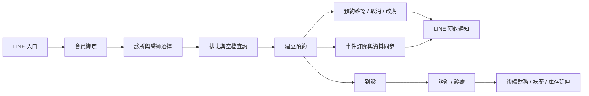
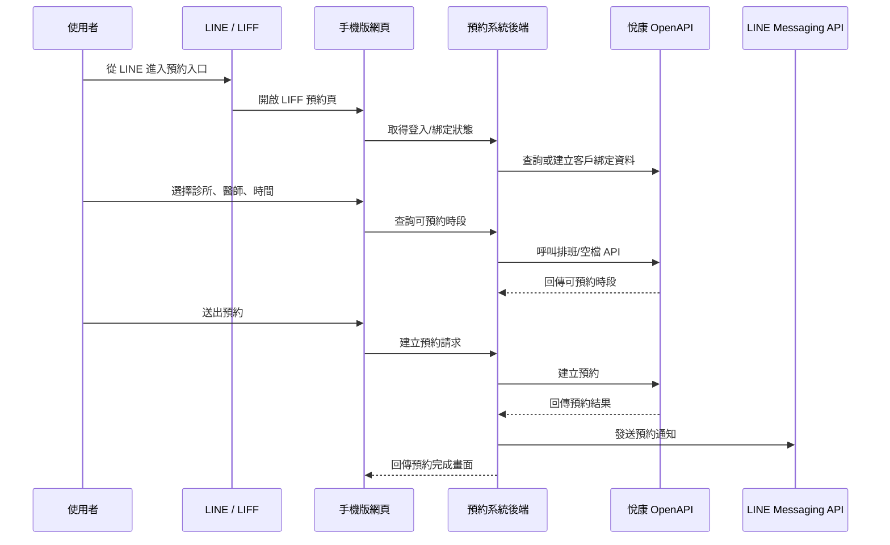

# 診所預約系統前期作戰提案

> 文件定位：給我自己的工程準備手冊  
> 產出日期：2026-05-19  
> 狀態：需求尚未落地，先做可復用的前期準備  
> 主要資料來源：`AGENT.md`、`docs/我與學長的對話.txt`、`yuekang-openapi-docs/`

## 1. 提案摘要

目前這個案子還在非常前期：已知方向是「診所預約系統」，預計做手機版網頁，不做 App，使用者可能落在 3,000 到 4,000 人左右。系統需要串接第三方診所營運平台，尤其是醫師排班、預約、客戶資料；同時 LINE API 是必備能力，用來支援 LINE 入口、會員綁定與預約通知。

現階段不建議直接進入正式功能開發。比較有價值的做法，是先把未來一定會用到、且不依賴最終需求細節的工程資產準備起來：API 能力盤點、DDD 領域模型、PoC、測試骨架、資料同步策略、LINE 整合策略與開發前問題清單。

這份文件的目標不是報價，也不是正式 PRD，而是幫我在專案未確定時先累積籌碼。未來如果案子落地，可以直接把這份文件拆成 PRD、技術規格、PoC 任務與開發 backlog。

## 2. 目前已知資訊

| 項目 | 已知內容 | 對工程的影響 |
| --- | --- | --- |
| 產品型態 | 手機版網頁，不做原生 App | 前端應以 mobile-first、Line 內開啟體驗為優先 |
| 核心功能 | 診所預約，可選醫師與時間 | 排班、空檔、預約狀態會是核心風險 |
| 第三方系統 | 需要串接醫師排班 API | 不應自行假設排班規則，需以第三方平台為準 |
| 通知入口 | 需要 LINE API | LINE 不是可選功能，需從第一版架構納入 |
| 使用規模 | 可能 3,000 到 4,000 人 | 不算超大流量，但需要穩定、可追蹤、可補償 |
| 技術限制 | Python (Django) + Node.js | 後端使用 Django 框架與 uv 管理套件，需整合 mypy, ruff 與 pytest |
| 開發方式 | 遵循 Clean Code, DDD 與 TDD | 必須先撰寫單元測試以確保完整覆蓋，並切分 bounded context |

## 3. 為什麼現在不該急著直接開發

目前最大的問題不是技術做不做得出來，而是「哪些功能真的要做」還不明確。診所預約系統看似單純，但一旦串到第三方營運平台與 LINE，實際上會牽涉到身份、會員、診所、醫師、排班、預約、到診、通知、事件同步與資料補償。

如果現在直接開發，容易出現幾個風險：

- 把第三方平台已經有的功能重做一遍，造成維護成本過高。
- 預約狀態、取消規則、改期規則沒有釐清，導致資料不一致。
- LINE 綁定流程晚期才加入，造成會員身份重構。
- 沒有先驗證 webhook、事件訂閱與歷史補償，未來漏單或漏通知難追。
- 沒有先建立測試邊界，DDD 最後只剩資料夾命名，沒有真的保護業務規則。

因此，現階段最值得做的是「降低未來開發不確定性」，而不是急著寫完整產品。

## 4. 建議的完整診所流程地圖

以下是完整診所流程的初步領域地圖。這不是第一版必做範圍，而是用來理解整體系統邊界。

目前應優先把這張圖當作討論框架。真正進入開發前，必須確認哪些節點由我們系統負責，哪些節點由悅康或其他診所平台負責。

## 5. DDD 初步 bounded context

| Context | 責任 | 前期可先準備的產物 |
| --- | --- | --- |
| Member Identity | LINE 使用者、手機、診所客戶資料的綁定關係 | `LineUser`、`MemberBinding`、`CustomerIdentity` 初步模型與測試案例 |
| Clinic Directory | 診所、科室、醫師、治療室等查詢資料 | 第三方 API adapter、查詢 DTO、快取策略草案 |
| Scheduling | 醫師排班、可預約時段、空檔查詢 | 排班查詢模型、空檔查詢 PoC、時區與時間格式測試 |
| Appointment | 預約建立、取消、確認、改期 | `Appointment` aggregate、狀態機、冪等鍵、失敗補償策略 |
| Notification | 預約成功、取消、提醒、改期通知 | LINE Messaging API adapter、通知模板、發送紀錄模型 |
| Integration Events | 悅康事件訂閱、歷史事件補償、同步狀態 | webhook receiver、event log、idempotency、replay 機制 |
| Visit & Care | 到診、諮詢、診療流程 | 先列為延伸 context，等需求確認後再細化 |
| Billing & Records | 訂單、收款、病歷、庫存 | 高風險延伸 context，前期只做 API 能力理解 |

這樣切分的重點是讓核心預約流程可以被測試保護，同時避免把第三方 API 的欄位直接滲透到所有業務邏輯中。

## 6. 悅康 OpenAPI 對接策略

目前 `yuekang-openapi-docs` 顯示悅康 OpenAPI 規模為 181 paths、207 operations、486 schemas，屬於中大型整合平台，不是單純預約 API。前期應先聚焦和預約系統直接相關的模組。

### 6.1 必看 API 模組

| 模組 | 用途 | 前期任務 |
| --- | --- | --- |
| 基礎安全機制 | token 取得與刷新 | 驗證登入、刷新、過期、錯誤碼 |
| 基礎營運資料 | 診所、員工、科室、組織 | 建立診所/醫師查詢 adapter |
| 診療服務流程 | 預約、排班、到診、諮詢 | 驗證預約建立、取消、確認、空檔查詢 |
| 客戶關係管理 | 客戶、會員、標籤、帳戶 | 驗證手機查客戶、建立/綁定客戶 |
| 業務事件訂閱 | webhook 與歷史事件 | 驗證 topic、subscribe、event-history |
| SCRM 集成服務 | 微信粉絲與綁定 | 僅作為參考，不等同於 LINE 整合 |

### 6.2 優先驗證端點

| 能力 | 端點 |
| --- | --- |
| 取得 token | `POST /api/v1/auth/login` |
| 刷新 token | `POST /api/v1/auth/refresh` |
| 查診所 | `GET /api/v1/foundation/clinic` |
| 查員工/醫師 | `GET /api/v1/foundation/employee` |
| 查排班 | `GET /api/v1/workflow/schedule` |
| 查預約空檔 | `POST /api/v1/workflow/appointment/getAppointmentFreeList` |
| 建立預約 | `POST /api/v1/workflow/appointment` |
| 取消預約 | `PUT /api/v1/workflow/appointment/{id}/cancel` |
| 確認預約 | `PUT /api/v1/workflow/appointment/{id}/confirm` |
| 手機查客戶 | `GET /api/v1/crm/customer/findByMobile` |
| 事件 topic | `GET /api/v1/event/topic` |
| 建立事件訂閱 | `POST /api/v1/event/subscribe` |
| 查歷史事件 | `GET /api/v1/event/event-history` |

### 6.3 對接原則

- 不讓 controller 或前端直接依賴悅康 OpenAPI response schema。
- 建立 `YuekangClient` 作為基礎 HTTP client，集中處理 token、錯誤、重試、request id、log。
- 每個 bounded context 建立自己的 adapter，例如 `AppointmentGateway`、`ClinicDirectoryGateway`、`CustomerGateway`。
- 對所有寫入型操作設計冪等策略，尤其是建立預約、取消預約、事件補償。
- webhook 與 event-history 都要寫入本地 event log，避免只靠即時 callback。

## 7. LINE API 必備功能設計

LINE API 是本案必備能力，不能視為後期加值功能。建議從第一版架構就拆成三個能力：LINE 入口、會員綁定、預約通知。

| 能力 | 建議使用 | 目的 |
| --- | --- | --- |
| LINE 入口 | LIFF | 讓手機版預約頁能在 LINE 內開啟，取得穩定的 LINE 使用情境 |
| 會員綁定 | LINE Login | 取得 LINE 使用者身份，建立 `lineUserId` 與診所客戶資料的綁定 |
| 預約通知 | Messaging API | 發送預約成功、取消、改期、提醒等通知 |

### 7.1 LINE 入口

- 預設使用 LIFF 作為手機版網頁入口。
- 使用者從 LINE 官方帳號選單、推播訊息或連結進入預約頁。
- 前端需要處理 LIFF 初始化、登入狀態、外部瀏覽器 fallback。
- 後端不應直接相信前端傳來的 LINE user id，需用 LINE token 驗證或由可信流程取得身份。

### 7.2 會員綁定

會員綁定的核心不是「有沒有 LINE 登入」，而是要建立三種身份的對應關係：

- LINE 使用者身份：`lineUserId`
- 診所客戶身份：悅康 customer id 或 patient id
- 手機號碼或其他診所端可識別資料

建議流程：

1. 使用者從 LIFF 進入預約頁。
2. 系統取得 LINE 使用者身份。
3. 使用者輸入手機號或診所要求的識別資訊。
4. 後端呼叫悅康 CRM API 查詢客戶。
5. 找到客戶後建立本地綁定紀錄。
6. 後續預約與通知都以這份綁定紀錄為主。

### 7.3 預約通知

通知應使用 LINE Messaging API，不使用 LINE Notify。LINE Notify 已於 2025-03-31 結束服務，不能作為新系統方案。

第一版應至少準備這些通知事件：

- 預約建立成功
- 預約取消成功
- 預約改期成功
- 預約前提醒
- 預約失敗或需人工協助

通知不應只做「送出 API」。它需要本地發送紀錄，至少包含：接收者、通知類型、預約 id、LINE message id 或 request id、發送狀態、錯誤訊息、重試次數。

## 8. 預約流程資料流

建議先用以下資料流作為 PoC 與未來開發的基準。

這條流程裡，最需要測試保護的是：身份綁定、空檔查詢、建立預約、通知發送、重複送出、第三方 API 失敗。

## 9. 現階段可以先做的工程準備

### 9.1 API 能力與契約整理

- 將悅康 OpenAPI 轉成穩定的 `swagger.yaml` / `openapi-default.yaml` 作為合約來源。
- 整理預約相關端點的 request / response 範例。
- 建立 API 能力地圖，標記哪些端點屬於第一階段必驗證。
- 建立第三方 API 問題清單，尤其是錯誤碼、token、rate limit、webhook 簽名、重試、保序。

### 9.2 DDD 領域模型草稿

先不用寫完整 production code，可以先寫 domain model 與測試案例來驗證理解。

建議優先建模：

- `MemberBinding`
- `Clinic`
- `Doctor`
- `ScheduleSlot`
- `Appointment`
- `AppointmentStatus`
- `NotificationRequest`
- `IntegrationEvent`

建模重點不是欄位完整，而是狀態與規則，例如：

- 未綁定會員不能建立預約。
- 已取消預約不能再次取消。
- 預約建立成功後才可送成功通知。
- 同一個外部預約 id 重複 callback 不能重複處理。

### 9.3 PoC

PoC 不做完整 UI，也不承諾正式體驗。它只驗證正式開發前最危險的事情。

建議 PoC 項目：

- 悅康 token 取得與刷新。
- 查診所、查醫師、查排班。
- 查空檔並建立一筆測試預約。
- 取消或確認一筆測試預約。
- 查事件 topic，建立 webhook 訂閱，驗證 event-history。
- 建立 LINE LIFF 測試入口。
- 完成 LINE 使用者與測試 customer 的綁定。
- 用 Messaging API 發送一則預約通知。

### 9.4 測試骨架

本案需要先建立測試方式，不然後期很難補。

| 測試類型 | 目的 |
| --- | --- |
| Domain unit test | 驗證預約狀態、會員綁定、通知規則 |
| Contract test | 驗證 adapter 對第三方 API schema 的假設 |
| Integration test | 驗證 token、查詢、預約、通知等真實串接 |
| Webhook test | 驗證重複事件、失敗重試、歷史補償 |
| E2E smoke test | 驗證從 LIFF 入口到預約完成的核心流程 |

測試覆蓋的重點應放在 domain object 與 adapter 邊界，不是單純追求 controller 覆蓋率。

## 10. 開發前必問問題清單

### 10.1 產品與流程

- 使用者是否一定從 LINE 進入，還是也允許一般瀏覽器進入？
- 預約是否需要登入後才能查空檔？
- 使用者可以取消或改期到什麼時間點？
- 預約是否需要診所人工確認？
- 醫師、診所、服務項目之間的可預約關係由誰決定？
- 預約失敗時是否需要轉人工客服？

### 10.2 悅康 API

- 正式環境 base URL 是什麼？是否需要 IP 白名單？
- token 有效期與 refresh 規則是什麼？
- 預約 API 是否支援冪等鍵？如果重複送出會怎麼處理？
- 空檔查詢是否已包含醫師休假、治療室、服務項目時長？
- 取消、確認、改期的狀態流轉規則是什麼？
- webhook callback 是否有簽名？失敗是否重試？是否保序？
- event-history 是否足以補償漏接事件？保留多久？

### 10.3 LINE API

- 客戶是否已經有 LINE Official Account？管理權限是否可交接？
- 是否已有 Messaging API channel 與 LINE Login channel？
- LIFF app 要掛在哪個 LINE Login channel？
- 通知訊息是否需要 Flex Message 模板？
- 是否需要 rich menu 作為預約入口？
- 使用者封鎖官方帳號時，通知失敗如何處理？

### 10.4 維運與責任邊界

- 預約異常時由誰處理？診所、學長、還是我們？
- 第三方 API 當機時，系統要顯示維護中、稍後重試，還是轉人工？
- 正式上線後是否需要後台查詢預約與通知紀錄？
- 個資、病歷、財務資料是否會進入我們系統？如果會，需要更高規格的安全設計。

## 11. 可以先做但不會浪費的產物

即使專案最後沒有落地，以下產物仍然有價值：

- OpenAPI 整理與能力地圖。
- 預約系統 DDD bounded context 草稿。
- 悅康 API adapter 介面設計。
- LINE LIFF / Login / Messaging API 整合筆記。
- 預約流程 sequence diagram。
- PoC 任務清單與驗收標準。
- 第三方 API 風險與問題清單。
- Domain test 範例。
- Webhook 冪等與補償策略草案。

這些都不是一次性文件。未來若正式開發，可以直接轉成 README、ADR、test fixture、adapter skeleton 或 backlog。

## 12. 未來進入開發前的準備完成標準

在正式開發前，至少應達成以下條件：

- 已能取得悅康 token 並呼叫至少一個查詢 API。
- 已能查到診所、醫師或排班資料。
- 已確認是否能建立、取消、確認預約。
- 已確認 LINE Official Account、Messaging API channel、LINE Login channel 與 LIFF app 的權限歸屬。
- 已完成一條測試用會員綁定流程。
- 已能發送一則 LINE 預約通知。
- 已釐清 webhook 的簽名、重試、保序與歷史補償能力。
- 已定義核心 domain object 與測試策略。
- 已確認哪些資料要落本地 DB，哪些只透過第三方 API 即時查詢。

如果以上條件沒有達成，就不適合承諾正式範圍、工期或維運責任。

## 13. 現階段最有價值的行動清單

1. 把悅康 API 中與預約、排班、客戶、事件相關的端點整理成「第一階段必驗證清單」。
2. 畫出完整預約流程，標註每一步由本系統、悅康、LINE 哪一方負責。
3. 寫出 DDD 初步模型與狀態轉換測試，先保護核心預約規則。
4. 做一個很小的 PoC：取得 token、查排班、建立測試預約、發 LINE 測試通知。
5. 整理要問學長或對方廠商的問題，優先問會影響架構與責任邊界的問題。
6. 不急著做完整 UI；最多先做低保真流程圖或簡單 mobile wireframe。
7. 不急著估價；等 PoC 與責任邊界清楚後再談。

## 14. 參考資料

- 本地專案說明：`AGENT.md`
- 對話紀錄：`docs/我與學長的對話.txt`
- 悅康 OpenAPI 整理：`yuekang-openapi-docs/`
- LINE Developers Products：https://developers.line.biz/
- LIFF Server API：https://developers.line.biz/en/reference/liff-server/
- LINE Notify 結束服務公告：https://notify-bot.line.me/

## 15. 結論

這個案子可以視為一個完整診所預約與整合平台的早期雛形，不只是做一個表單送預約。真正困難的地方會在第三方資料口徑、預約狀態一致性、LINE 身份綁定、通知可靠性、事件同步與維運責任。

現階段最正確的策略，是先把工程準備做紮實：看懂 API、驗證關鍵串接、建立領域模型、設計測試邊界、釐清 LINE 官方帳號與第三方平台責任。等需求真的落地時，這些準備會直接變成開發速度與報價可信度。

### 備註

#### 工程評估與實作防禦建議 (2026-05-20 補充)

基於最新的專案規範 (`AGENT.md`)，在此補充對應的工程實作提醒：

1.  **技術棧與架構對齊**：
    *   **後端框架與依賴管理**：已明確指定使用 Python 的 Django 框架，並以 `uv` 進行套件管理。後續的 PoC 與基礎建設將圍繞 Django 的生態系（如 Django REST Framework）進行構建。
    *   **靜態分析與測試**：強制導入 `mypy` (型別檢查)、`ruff` (Linter/Formatter) 與 `pytest`。所有程式碼提交前必須通過嚴格的靜態分析。
    *   **領域驅動與測試驅動 (DDD & TDD)**：系統架構必須遵循 Clean Code 原則與 DDD 分層架構。每個領域模型與業務規則都必須在撰寫實作前，先寫出對應的 `pytest` 單元測試以確保完整的測試覆蓋率。

2.  **併發搶號風險 (Concurrency)**：
    *   在「查詢預約空檔」到「確認建立預約」的流程中，存在明顯的時間差。如果同一時間有多名使用者預約同一個醫師的同一時段，會引發 Race Condition。
    *   我們需要設計妥善的重試機制或友善的錯誤提示，並確認悅康 API 在遇到時段衝突時的回傳行為，確保系統不會因此陷入不一致的狀態。

3.  **機敏資料遮蔽 (PII Masking)**：
    *   系統將頻繁經手使用者的真實手機號碼與客戶身分資料。
    *   在設計 `YuekangClient` 的 Request/Response 日誌記錄 (Logger) 時，必須從第一天起就對 PII (Personally Identifiable Information) 欄位進行遮蔽（例如將手機號碼轉換為 `0912***789`），以符合資安規範並避免敏感資料外洩。

